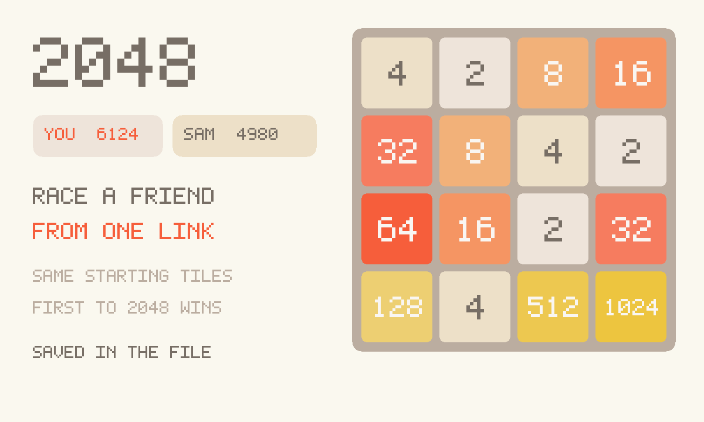

# 2048

The original **2048** by Gabriele Cirulli, running as a GifOS app. Swipe or
use the arrow keys, merge matching tiles, get to 2048. Playing alone is that
game. Press **Play a friend**, then **Invite**, and it becomes a race from the
same starting tiles. Press **Games** and every board you have ever played is
still there.



## What it is

An unofficial local port of [gabrielecirulli/2048](https://github.com/gabrielecirulli/2048)
(MIT). The JS, CSS, swipe handling and tile animation are the original. Two
things changed, both because they have to:

- **Save.** Upstream wrote `localStorage`. A GifOS app cannot. The best score
  and every game go into a private `save` collection, on this device, inside
  the app. Close the tab, come back, the board is where you left it.
- **Your games.** Upstream keeps ONE game state and New Game overwrites it —
  the board you reached 4096 on is gone the instant you deal the next one.
  Here the current game is a ROW in an archive, so New Game opens a new one
  and leaves the old alone. See below.
- **Play a friend.** Upstream is strictly one player. This adds a race. It is
  not a shared board.

```
index.html      original board markup + the friend-mode strip + Games panel
style.css       friend-mode chrome and the Games panel (cream/brown is upstream)
hist.js         the archive: one row per game, pure, db injected
hist-ui.js      the Games panel: previews, resume, delete-with-confirm
storage.js      LocalStorageManager over gifos.db('save'), private
mp.js           the race: shared seed, own rows, live scores
app.js          boot, seeded RNG seam, Invite-aware restart
icon.mjs        procedural grid icon + 1200×720 cover
vendor.mjs      rebuilds vendor/ from the pinned 2048 commit
build.mjs       packs the GIF into site/apps/2048/2048.gif
vendor/         GENERATED. Original classic scripts + inlined Clear Sans.
```

## capabilities

| capability | why |
|---|---|
| `db` | Solo save (private) and the room’s live scores (read-write). Needs nothing newer than the App Store itself, so `minBuild` is **947**. |
| `multiplayer` | The room. Invite is OS chrome — this app never draws its own share sheet. |

No `network`, no `wasm`. The original is plain JS.

## How the archive works

Upstream's model is one slot: `setGameState` writes it, `clearGameState`
empties it, and both New Game and game-over call the second one. That single
slot is the bug — there is no board to go back to because there was never
anywhere a board had been.

So `hist.js` makes the current game a **row**, and `storage.js` points at it:

- `getGameState()` → the row the pointer is on. `setGameState()` → write that
  row, creating it on the first actuate (a game is archived from its opening
  tiles, so closing the tab mid-game loses nothing).
- `clearGameState()` → **let go of** the row, not erase it. That is all New
  Game does now.
- Resuming is `resume(id)` — move the pointer, re-`setup()`. The game you were
  on was already written by its last move, so switching is lossless in **both**
  directions. The list is a game switcher, not a graveyard.

Two boards upstream never writes, and this does:

- **The losing board.** `actuate()` calls `clearGameState()` the moment `over`
  is true, so the final position — the one you are staring at — is the one
  position never saved. `app.js` calls `LocalStorageManager.finalize()` before
  handing off to the original.
- **The board you walked away from.** It is a row; walking away is free.

Rules, deliberately:

- **No cap, no expiry, no LRU.** A game leaves only through the trash button,
  which asks first. The honest cost is unbounded growth: a row is under 1 KB
  (measured 876 bytes for a full 16-tile board), so a thousand games is under
  a megabyte — and that megabyte rides inside the GIF when you save or send
  the file, because the file IS the save. Boot reads the whole collection in
  one `getAll`. If this ever needs a bound it needs a UI for it, not a silent
  prune: a cap that quietly ate the 4096 board would be the original bug back
  again, wearing a number.
- **A board nobody moved is not a game.** `detach()` drops a row with zero
  moves, so changing your mind about a deal leaves no trace and the list stays
  the games that matter.
- **Best score is not in the archive.** It is one all-time number; deleting a
  game does not lower it.
- **A race is never archived.** Friend-mode short-circuits every storage
  method, exactly as it did before.
- A signature (cells + score + flags) gates writes, so booting the app or
  re-opening an archived board costs neither a db write nor a phantom move.

`hist.js` takes its db by injection and touches no DOM, which is what lets
`test/unit/2048.js` play whole games — including one played to a real
game-over — through the shipped vendor `GameManager` in a vm.

## How the race works

1. Press **Play a friend**. Press **Invite** (the GifOS menu — this app never
   draws its own share sheet) to send the link. Solo still works if nobody
   comes — you can play while you wait. Live scores sit in a compact strip
   above the board so the grid stays on screen.
2. Everyone who is in the room **starts from the same two tiles**. The seed
   lives on each player’s own row; everyone adopts the seed of the
   lowest-id player on the current round. If you make the same moves, you
   get the same board. If you don’t, the boards diverge — that is the race.
3. Each player publishes **score + board hash + highest tile** on **their own
   row**. Nobody writes anybody else’s row. The list of live scores is just
   those rows.
4. **First to a 2048 tile wins.** If that never happens and a board fills
   (no moves left), that player is out; the others keep going. When every
   remaining board is stuck, **highest score** wins. A tie is a tie.
5. **Play again** starts the next round with a new seed. **← Solo** puts you
   back on the original game, with the save you had before the race.

Honest limits: this is friends, not a ladder. There is no referee and no
anti-cheat — a client that lied about its score would be believed. A player
who goes silent for a few seconds drops off the list (rows persist in the
host’s copy of the room, so staleness is “the row stopped changing”, not
“the row exists”). The host’s browser holds the room; if they leave and
nobody chose **keep the room alive** on Invite, the race ends. A joiner
who arrives mid-round starts from the *opening* tiles of that seed, not
from your current board — they are racing, not spectating.

## Building

```bash
node apps/2048/vendor.mjs      # only when moving the 2048 pin (needs net)
node apps/2048/build.mjs       # -> site/apps/2048/2048.gif
node test/unit/2048.js         # the archive, played not mocked
```

Do not bump `GIFOS_VERSION`. The catalog refresh (`build-app-catalog.mjs`)
is a separate, signed step.

## Licence

2048 is MIT, Gabriele Cirulli, 2014. The notice is packed **inside the GIF**
as `COPYING-2048.txt` as well as living at `vendor/COPYING-2048.txt`. Clear
Sans (the typeface upstream ships) is Apache-2.0, inlined into `vendor/main.css`.
