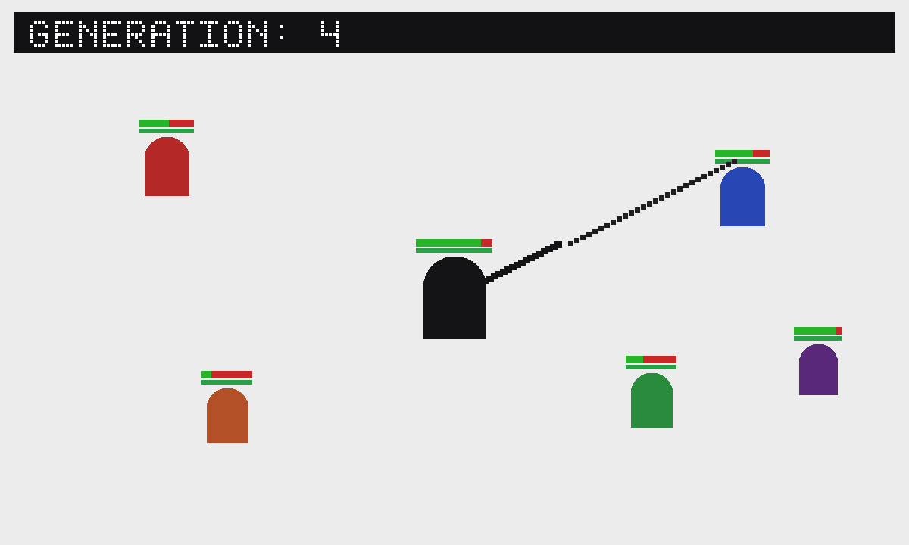

# Aim and Shoot

An unofficial port of **[Aim and Shoot](https://github.com/victorqribeiro/aimAndShoot)**
by Victor Ribeiro (MIT). A neuroevolution canvas shooter: you aim, the bots
learn. Phone stick + right-side aim + FIRE under the thumb. Best generation
in the file. An invite is ONE arena: the app owner simulates and publishes
`world`, guests publish input and draw what comes back (coop.js).



Upstream is classic scripts plus a PNG and an MP3. GifOS inlines those as
data URLs (`vendor/assets.js`). The service worker is not shipped. Resize
no longer restarts the round.

```
index.html      canvas host, scripts
style.css       full-bleed canvas, dark chrome
boot.js         save + pad reveal + team rules (prototype patches)
coop.js         one arena: owner simulates, guests send input
icon.mjs        aiming figure + 1200×720 cover
build.mjs       packs site/apps/aim-and-shoot/aim-and-shoot.gif
vendor/         pinned scripts, art, shot, MIT notice
```

## Building

```bash
node apps/aim-and-shoot/build.mjs
```

Do not run `scripts/build-app-catalog.mjs` from this change.

## Licence

Victor Ribeiro's MIT notice is packed **inside the GIF** as
`COPYING-aim-and-shoot.txt`.
