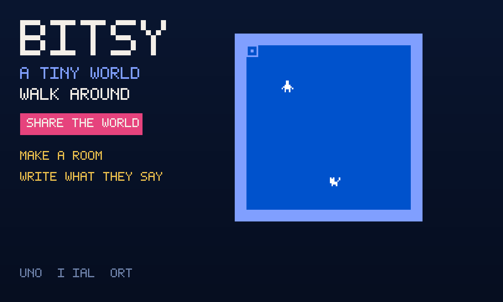

# Bitsy

An unofficial local port of **[Bitsy](https://github.com/le-doux/bitsy)**
(MIT) by Adam le Doux. A tiny world you walk around in. A few worlds
already here. Press **Make** to draw a room of your own. Playing alone,
the world is saved on this device. Press **Share the world**, then
**Invite**, and a friend walks in the same room.

The full Bitsy editor is huge (an 8 MB resource pack of icons, extra
fonts, localisation). This port ships the **player**, a handful of
worlds, and a small editor — floor, friend, words, and the world as
writing.



```
index.html                 shell: the room, worlds, make/play, friend chrome
style.css                  dark blue room, pink talk, friend chrome
worlds.js                  three original rooms + the official example
editor.js                  room paint, 8×8 drawing, words, world writing
app.js                     play / make / last world in gifos.db
mp.js                      shared world writing, own-row publish
icon.mjs                   procedural cat-in-a-room icon + 1200×720 cover
vendor.mjs                 rebuilds vendor/ from the pinned bitsy v8.15
build.mjs                  packs the GIF into site/apps/bitsy/bitsy.gif
vendor/bitsy-engine.js     GENERATED. Player (system + engine) concat.
vendor/font.js             GENERATED. ascii_small as BITSY_DEFAULT_FONT.
vendor/example.js          GENERATED. Official cat-and-tea example.
vendor/COPYING-*.txt       MIT notice + CREDITS, packed inside the GIF
```

## capabilities

| capability | why |
|---|---|
| `db` | Last world (private) and the room’s writing (read-write). Needs nothing newer than the App Store itself, so `minBuild` is **947**. |
| `multiplayer` | The room. Invite is OS chrome — this app never draws its own share sheet. |

No `network`, no `wasm`. The original player is classic scripts. Touch
stays on the game canvas (upstream’s fullscreen overlay would eat the
chrome). Typing in a box does not steal arrow keys.

## How the world is shared

1. Press **Share the world**. Press **Invite** (the GifOS menu) to send
   the link. Solo still works if nobody comes.
2. Everyone who is in the room **starts from the same world writing**.
   The writing lives on each player’s own row; everyone adopts the world
   of the lowest-id player on the current round.
3. **Play**, picking a world, or **Use this writing** publishes a new
   round. Nobody writes anybody else’s row.
4. **← Solo** puts you back on the original toy.

The host’s browser holds the room; if they leave and nobody chose
**keep the room alive** on Invite, the square empties.

## Building

```bash
node apps/bitsy/vendor.mjs   # only when moving the pin (needs net)
node apps/bitsy/build.mjs    # -> site/apps/bitsy/bitsy.gif
```

Do not run `scripts/build-app-catalog.mjs` from this change — `index.json`
is owned elsewhere.

## Licence

Bitsy is MIT, Bitsy authors (see CREDITS). The notice is packed
**inside the GIF** as `COPYING-bitsy.txt` as well as living at
`vendor/COPYING-bitsy.txt`.
