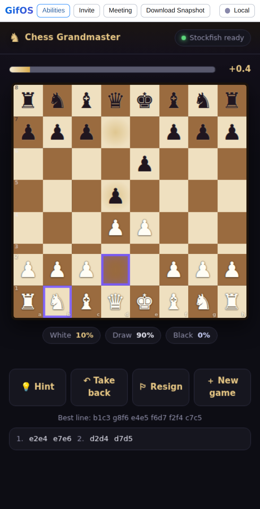

# Chess Grandmaster

Play **full-strength Stockfish** — the real engine, NNUE and all — running
entirely on your device, offline, inside the GifOS sandbox. Pick a level from
club player to the unshackled engine, and watch the live win / draw / loss
read-out as it thinks.



## What it is

A complete chess app in one GIF:

- **A real engine.** This bundles Stockfish 18 (the *lite single-threaded* WASM
  build), NNUE evaluation net embedded. Not a JavaScript reimplementation — the
  actual engine, compiled to WebAssembly.
- **Pick your level.** A strength ladder from ~1320 Elo (Beginner) up through
  Grandmaster (~2850), plus a top rung that removes the leash entirely
  (Skill Level 20, no Elo cap) — objectively stronger than any human alive.
- **Live probabilities.** With `UCI_ShowWDL` on, every search reports the
  engine's win / draw / loss odds; the app shows them from White's side, plus a
  centipawn evaluation and the best line it's found.
- **Hints, take-backs, resign, promotion picker,** and your game auto-saves
  into the icon (close the tab, come back, resume right where you were).

## Why it needs `capabilities.wasm`

GifOS apps run in a locked-down sandbox: an opaque origin with
`connect-src 'none'` (no network) and no `'wasm-unsafe-eval'` — which means
WebAssembly is normally refused outright. A chess engine can't run there.

So this app declares the **`wasm`** capability. That relaxes the sandbox CSP by
exactly two things and nothing else:

- `'wasm-unsafe-eval'` in `script-src` — so a WebAssembly module can be
  instantiated at all.
- `worker-src blob:` — so heavy WASM engines can run on a Web Worker.

**`connect-src` stays `'none'`.** The engine gets *zero* network. Its `.wasm`
(with the NNUE net inside) is handed to it as bytes via `wasmBinary`, so nothing
is ever fetched. The engine can compute; it cannot phone home. When you open the
app, the abilities acknowledgement tells you plainly that it "runs a compiled
engine on your device."

This app runs the engine on the **main thread** (the build is compiled with
Asyncify, so `go` searches yield to the event loop and the board stays
responsive); the `worker-src` relaxation is part of the capability for engines
that prefer a worker.

## Building

```
node apps/chess-grandmaster/build.mjs
```

That packs the source below into the finished, self-contained
`apps/chess-grandmaster.gif` (~8 MB — it carries the whole engine). Two of the
packed files are generated from the vendored engine at build time:

- `sf-glue.js` — the Stockfish glue, made executable, with its self-init tail
  rewritten so the module factory lands on `window.SF_FACTORY`.
- `sf-wasm.js` — `window.GM_WASM_B64`, the `.wasm` as base64, handed to the
  engine as `wasmBinary`.

### Source layout

| file             | what it is                                                        |
|------------------|-------------------------------------------------------------------|
| `index.html`     | shell + script order                                              |
| `style.css`      | board, eval bar, controls                                         |
| `chess.js`       | rules model — legal moves, castling, en passant, promotion, FEN   |
| `engine.js`      | Stockfish driver (UCI handshake, level config, search, WDL parse) |
| `app.js`         | game loop, board UI, persistence                                  |
| `icon.mjs`       | procedural app icon (glossy chessboard, sweeping sheen)           |
| `sf-src.js`      | vendored Stockfish glue (GPLv3, unmodified)                       |
| `stockfish.wasm` | vendored Stockfish engine binary (GPLv3)                          |
| `build.mjs`      | packer                                                            |

## License

The bundled Stockfish engine (`sf-src.js`, `stockfish.wasm`) is
**GPLv3** — see [`COPYING-stockfish.txt`](COPYING-stockfish.txt). Because this
app links the engine, the app as a whole is distributed under the GPLv3.
Stockfish is by the Stockfish developers; the WASM build is
[nmrugg/stockfish.js](https://github.com/nmrugg/stockfish.js), sponsored by
Chess.com. NNUE net by linrock.
