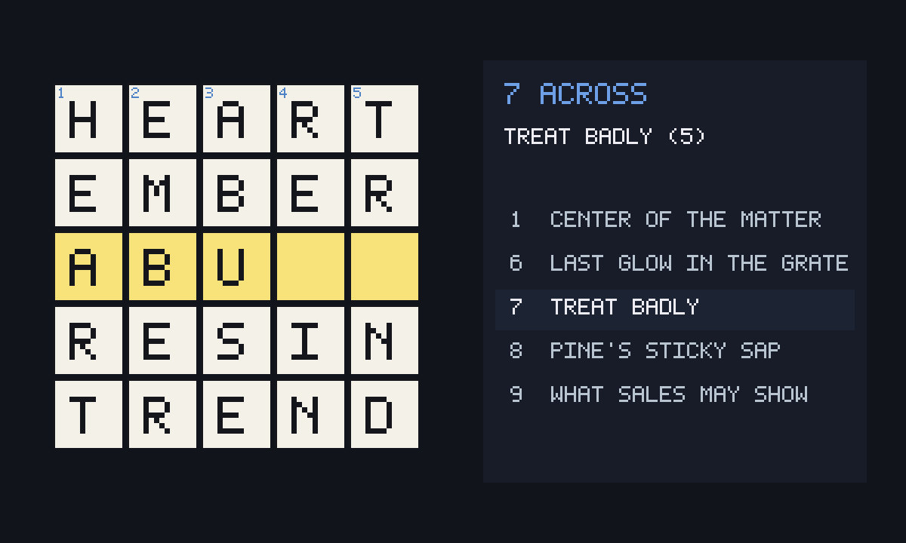

# Crossword

An unofficial port of **[crosswords-js](https://github.com/dwmkerr/crosswords-js)**
by Dave Kerr (MIT). The player plus three original puzzles. Progress in
the file. Invite shares the grid.



Upstream is an npm module. GifOS inlines the committed UMD build
(`dist/crosswords.umd.cjs`). The sample Guardian/Alberich puzzles are not
shipped — `vendor/puzzles.json` holds original grids (Heart 5×5, Racecar 7×7,
Sand 4×4). A v1 save with no puzzle id still opens Sand.

```
index.html      grid, clues, pad, hidden phone input
style.css       dark wrap around upstream CSS
app.js          controller, save, room, pad, native keyboard
icon.mjs        Heart filling in + 1200×720 cover
build.mjs       packs site/apps/crossword/crossword.gif
vendor/         UMD, CSS, puzzles, MIT notice
```

## Building

```bash
node apps/crossword/build.mjs
```

Do not run `scripts/build-app-catalog.mjs` from this change.
