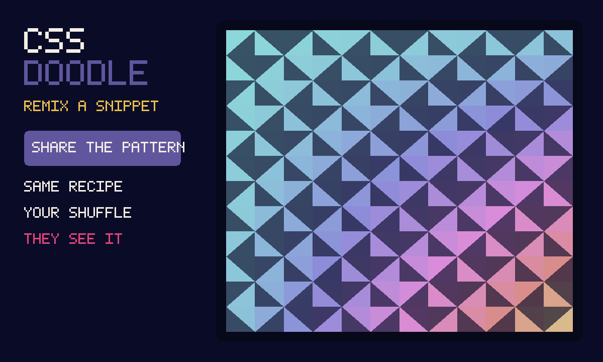

# CSS Doodle

An unofficial local port of
**[css-doodle](https://github.com/css-doodle/css-doodle)** (MIT). A
square that fills with a pattern. Tap a snippet to remix. Shuffle
re-rolls the random bits. Playing alone is that toy. Press
**Share the pattern**, then **Invite**, and a friend sees the same
recipe.



```
index.html                 shell: the square, remix chips, recipe box
style.css                  dark square, purple chips, friend chrome
snippets.js                eight recipes from css-doodle's own docs
app.js                     apply / shuffle / last pattern in gifos.db
mp.js                      shared pattern string, own-row publish
icon.mjs                   procedural tile-card icon + 1200×720 cover
vendor.mjs                 rebuilds vendor/ from the pinned npm tarball
build.mjs                  packs the GIF into site/apps/css-doodle/css-doodle.gif
vendor/css-doodle.js       GENERATED. css-doodle@0.51.0 classic IIFE.
vendor/COPYING-*.txt       Yuan Chuan's MIT notice, packed inside the GIF
```

## capabilities

| capability | why |
|---|---|
| `db` | Last pattern (private) and the room’s recipe (read-write). Needs nothing newer than the App Store itself, so `minBuild` is **947**. |
| `multiplayer` | The room. Invite is OS chrome — this app never draws its own share sheet. |

No `network`, no `wasm`. The original is a web component; Google Fonts
fetch in the IIFE is dead in the sandbox, and no snippet asks for a font.

## How the pattern is shared

1. Press **Share the pattern**. Press **Invite** (the GifOS menu) to send
   the link. Solo still works if nobody comes.
2. Everyone who is in the room **starts from the same recipe string**.
   The string lives on each player’s own row; everyone adopts the recipe
   of the lowest-id player on the current round.
3. **Apply**, **Remix**, **Shuffle**, or a tap on the square publishes a
   new round. Nobody writes anybody else’s row.
4. **← Solo** puts you back on the original toy.

The host’s browser holds the room; if they leave and nobody chose
**keep the room alive** on Invite, the square empties.

## Building

```bash
node apps/css-doodle/vendor.mjs   # only when moving the pin (needs net)
node apps/css-doodle/build.mjs    # -> site/apps/css-doodle/css-doodle.gif
```

Do not run `scripts/build-app-catalog.mjs` from this change — `index.json`
is owned elsewhere.

## Licence

css-doodle is MIT, Yuan Chuan, 2017–2025. The notice is packed
**inside the GIF** as `COPYING-css-doodle.txt` as well as living at
`vendor/COPYING-css-doodle.txt`.
