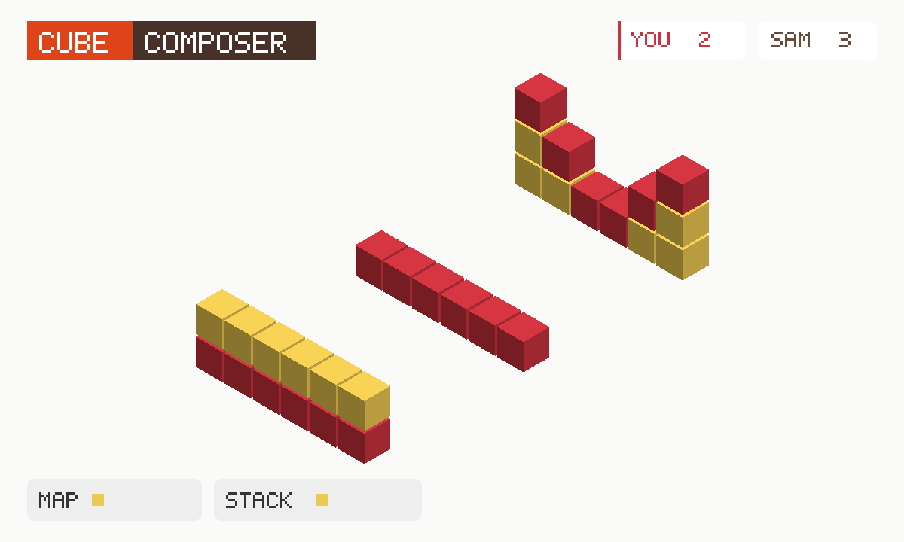

# Cube Composer

Line up little functions until the coloured cubes match the picture. Playing
alone is that puzzle. Press **Play a friend**, then **Invite**, and it becomes
a race on the same puzzle — first to match the picture wins. Progress lives
in the file.

An unofficial port of **[cube-composer](https://github.com/sharkdp/cube-composer)**
by David Peter / sharkdp (MIT). The original is PureScript (bower, gulp, a
2016 compiler). This copy rebuilds the same 25 puzzles as classic scripts so
they run in the sandbox, including on a phone.



```
index.html      shell: level picker, canvases, function lists, friend strip
style.css       Ocean Five on white, stacked for a phone
transformers.js Wall → Wall functions (the original Transformer.purs)
levels.js       six chapters, 25 puzzles, copied from src/Levels/
render.js       isometric cubes (the original used purescript-isometric)
app.js          tap/drag program, private save
mp.js           the race: same level, own rows, first to match
icon.mjs        procedural cube icon + 1200×720 cover
build.mjs       packs the GIF; BFS-checks every level still solves
```

## capabilities

| capability | why |
|---|---|
| `db` | Solo save (private) and the room’s live scores (read-write). Needs nothing newer than the App Store itself, so `minBuild` is **947**. |
| `multiplayer` | The room. Invite is OS chrome — this app never draws its own share sheet. |

No `network`, no `wasm`. Classic JS.

## How the race works

1. Press **Play a friend**. Press **Invite** (the GifOS menu) to send the link.
   Solo still works if nobody comes.
2. Everyone who is in the room **works the same puzzle**. The level lives on
   each player’s own row; everyone adopts the level of the lowest-id player on
   the current round.
3. Each player publishes **solved + step count** on **their own row**. The
   functions themselves never leave this device.
4. **First to match the picture wins.** Fewer steps is the tie-break if two
   people finish in the same moment.
5. **Next puzzle** starts the next round on the next level. **← Solo** puts
   you back on the original game, with the save you had.

## Building

```bash
node apps/cube-composer/build.mjs   # -> site/apps/cube-composer/cube-composer.gif
```

Do not bump `GIFOS_VERSION`. The catalog refresh (`build-app-catalog.mjs`) is
a separate, signed step.

## Licence

Cube Composer is MIT, David Peter, 2015–2016. The notice is packed **inside
the GIF** as `COPYING-cube-composer.txt`.
