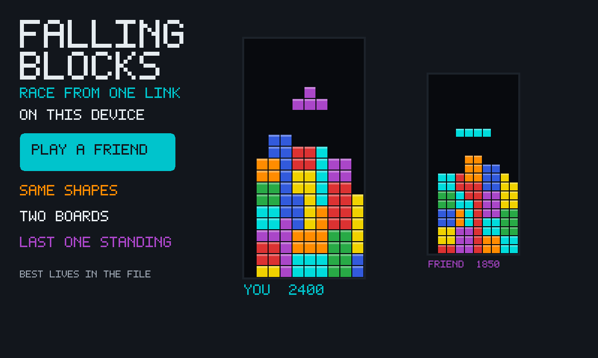

# Falling Blocks

An unofficial local port of
**[canvas-tetris](https://github.com/dionyziz/canvas-tetris)** by dionyziz
(MIT). Shapes drop, you slide and turn them, a full row vanishes. Playing
alone is that game. Press **Play a friend**, then **Invite**, and it becomes
a race from the same sequence of shapes — each of you on your own board.

This port is not branded as the well-known game of the same idea.



```
index.html      shell: two wells, next-piece, friend-mode strip, phone pad
style.css       dark well, race chrome, full-width pad
app.js          score, ghost, next, DAS/ARR, gravity, seeded RNG seam
mp.js           the race: shared seed, own rows, live scores, ghost well
touch.js        swipe + pad, same DAS path as the arrows
icon.mjs        lock + line-clear icon, mid-well cover
vendor.mjs      rebuilds vendor/ from the pinned canvas-tetris commit
build.mjs       packs the GIF into site/apps/falling-blocks/falling-blocks.gif
vendor/         original classic scripts. Never edit.
```

## capabilities

| capability | why |
|---|---|
| `db` | Solo best score (private) and the room’s live scores (read-write). Needs nothing newer than the App Store itself, so `minBuild` is **947**. |
| `multiplayer` | The room. Invite is OS chrome — this app never draws its own share sheet. |

No `network`, no `wasm`. The original is plain JS.

## How the race works

1. Press **Play a friend**. Press **Invite** (the GifOS menu) to send the link.
   Solo still works if nobody comes — you can play while you wait.
2. Everyone who is in the room **starts from the same sequence of shapes**.
   The seed lives on each player’s own row; everyone adopts the seed of the
   lowest-id player on the current round. If you make the same moves, you
   get the same board. If you don’t, the boards diverge — that is the race.
3. Each player publishes **score + lines + the well** on **their own row**.
   Nobody writes anybody else’s row. The list of live scores is just those
   rows; the other well is a ghost of that row.
4. **Last one still stacking wins.** If a board fills, that player is out;
   the others keep going. When every remaining board is stuck, **highest
   score** wins. A tie is a tie.
5. **Play again** starts the next round with a new seed. **← Solo** puts you
   back on the original game.

Honest limits: this is friends, not a ladder. There is no referee and no
anti-cheat — a client that lied about its score would be believed. A player
who goes silent for a few seconds drops off the list. The host’s browser
holds the room; if they leave and nobody chose **keep the room alive** on
Invite, the race ends. A joiner who arrives mid-round starts from the
*opening* shapes of that seed, not from your current pile — they are racing,
not spectating.

## Touch

Upstream is keys only (arrows + space). `touch.js` maps a swipe on the well
onto the same `keyPress` the keyboard uses, and on the first real
`touchstart` it shows a full-width pad. Hold-to-slide uses the same delay
then repeat as the arrows (a first move, a short pause, then a steady
slide) so a thumb and a keyboard feel like one game.

## Building

```bash
node apps/falling-blocks/vendor.mjs   # only when moving the pin (needs net)
node apps/falling-blocks/build.mjs    # -> site/apps/falling-blocks/falling-blocks.gif
```

Do not run `scripts/build-app-catalog.mjs` from this change — `index.json`
is owned elsewhere.

## Licence

canvas-tetris is MIT, Dionysis "dionyziz" Zindros, 2012. The notice is packed
**inside the GIF** as `COPYING-canvas-tetris.txt` as well as living at
`vendor/COPYING-canvas-tetris.txt`.
