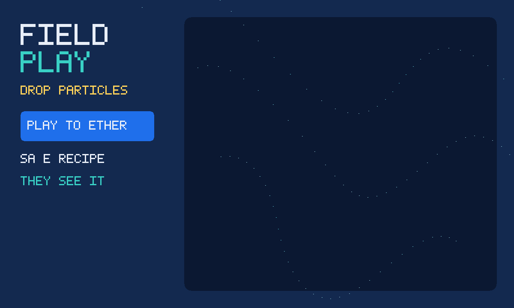

# Field Play

An unofficial local port of
**[Field Play](https://github.com/anvaka/fieldplay)** (MIT) by anvaka.
Drop particles on a field of arrows. Remix a named field. Playing
alone is that toy. Press **Play together**, then **Invite**, and a
friend sees the same recipe.



```
index.html                 shell: the field, remix chips, recipe box
style.css                  dark navy, cyan chips, friend chrome
app.js                     apply / last field in gifos.db
mp.js                      shared recipe string, own-row publish
icon.mjs                   procedural flow-card icon + 1200×720 cover
vendor.mjs                 rebuilds COPYING from the pinned commit
build.mjs                  packs the GIF into site/apps/fieldplay/fieldplay.gif
vendor/fieldplay.js        GENERATED-style classic IIFE. GPU particle loop.
vendor/presets.js          named fields from autoPresets.js (no texture fetches)
vendor/COPYING-*.txt       Andrei Kashcha MIT + Mapbox webgl-wind ISC
```

## capabilities

| capability | why |
|---|---|
| `db` | Last field (private) and the room’s recipe (read-write). Needs nothing newer than the App Store itself, so `minBuild` is **947**. |
| `multiplayer` | The room. Invite is OS chrome — this app never draws its own share sheet. |

No `network`, no `wasm`. Texture-backed presets from upstream that fetched gists are not shipped.

## Building

```bash
node apps/fieldplay/vendor.mjs   # only when moving the pin (needs net)
node apps/fieldplay/build.mjs    # -> site/apps/fieldplay/fieldplay.gif
```

Do not run `scripts/build-app-catalog.mjs` from this change — `index.json`
is owned elsewhere.

## Licence

Field Play is MIT, Andrei Kashcha, 2017–2026. The particle technique
follows Mapbox webgl-wind (ISC, Vladimir Agafonkin). Notices ride
**inside the GIF**.
