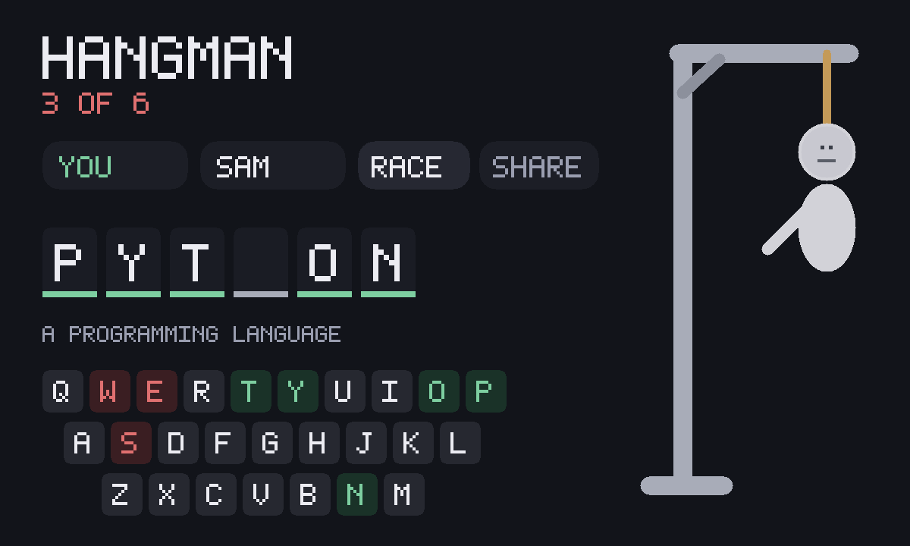

# Hangman

An unofficial port of **[Vanilla Javascript Hangman Game](https://github.com/simonjsuh/Vanilla-Javascript-Hangman-Game)**
by simonjsuh (MIT). Guess a programming language, six wrong letters, the
original gallows frames. Versus a friend: the same word — first to finish it,
or one shared rope.



Upstream is Bootstrap from a CDN plus `innerHTML` buttons. GifOS's runtime
drops `type="module"` and the sandbox has nowhere to fetch a CDN from, so this
tree is classic scripts. The gallows is an SVG that fills in (readable on a
phone); the original six frames still travel in the GIF. QWERTY, not A–Z.
Nothing is fetched.

```
index.html      shell: SVG gallows, letter tiles, QWERTY, how-to
style.css       dark card, phone-first
app.js          rules + gifos.db persistence + versus
icon.mjs        procedural gallows icon + 1200×720 cover
build.mjs       packs site/apps/hangman/hangman.gif
vendor/         pinned original script, frames, MIT notice
```

## Rules (same as upstream)

- One of fourteen programming-language words.
- Guess a letter. Right ones fill in. Six wrong ones and the drawing is done.
- The frames are the original six stages (PNG bytes, named `.jpg` as upstream).

## Versus

Invite is **OS chrome** — the bar above the app. This game does not draw its
own invite button.

When a second person opens the link, both play the **same** word.

- **Race.** Each person has their own drawing. Each writes **only their own**
  `players` row, and only a wrong-guess *count* (and whether they have
  finished), never the letters. First to finish the word wins.
- **Share the gallows.** Every letter anyone tries is on the same rope. The
  letters ride on each person's own row; the union is the drawing. Sink or
  swim together.

## capabilities

| capability | why |
|---|---|
| `db` | Solo game in progress, private, inside the icon. |
| `multiplayer` | Shared match + per-player rows. Needs nothing newer than the App Store, so `minBuild` is **947**. |

No `network`. The frames and the word list are in the GIF.

## Building

```bash
node apps/hangman/build.mjs
```

Writes `site/apps/hangman/hangman.gif`. Do not run
`scripts/build-app-catalog.mjs` from this change — `index.json` is owned
elsewhere.

## Licence

simonjsuh's MIT notice is packed **inside the GIF** as
`COPYING-hangman.txt` (`vendor/COPYING-hangman.txt`).
