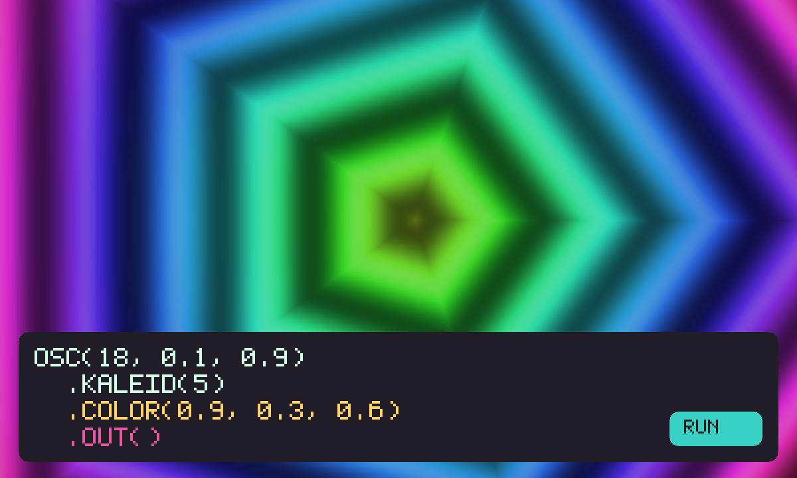

# Hydra

An unofficial local port of **[Hydra](https://github.com/hydra-synth/hydra)**
(AGPL-3.0) by Olivia Jack. A live-coded video synth. Playing alone is
that toy. Press **Jam together**, then **Invite**, and a friend runs
the same patch. Close it, come back — the last patch is still there.



```
index.html                 shell: canvas, named patches, recipe box
style.css                  dark synth, magenta chips, friend chrome
app.js                     apply / last patch in gifos.db
mp.js                      shared patch string, own-row publish
sketch.js                  restricted hydra interpreter (no eval)
snippets.js                eight getting-started patches
icon.mjs                   procedural kaleid-card icon + 1200×720 cover
build.mjs                  packs the GIF into site/apps/hydra/hydra.gif
vendor/hydra-engine.js     hydra-synth 1.4.0 GLSL pipeline + raw WebGL
vendor/glsl-functions.js   upstream function table (classic wrap)
vendor/utility-functions.js upstream util GLSL
vendor/COPYING-*.txt       AGPL-3.0 notice, packed inside the GIF
```

## capabilities

| capability | why |
|---|---|
| `db` | Last patch (private) and the room’s recipe (read-write). Needs nothing newer than the App Store itself, so `minBuild` is **947**. |
| `multiplayer` | The jam. Invite is OS chrome — this app never draws its own share sheet. |
| `launch.patch` | A shared URL can open a named patch (`?run=hydra&go.patch=kaleid`). |

No `network`, no `wasm`. Camera, microphone, and WebRTC from the original are not in this copy: generated sources only, plus `src(o0)` feedback. Sketch evaluation is a restricted interpreter because the sandbox CSP has no `unsafe-eval`.

## How the patch is shared

1. Press **Jam together**. Press **Invite** (the GifOS menu) to send the link. Solo still works if nobody comes.
2. Everyone who is in the room **starts from the same patch string**. The string lives on each player’s own row; everyone adopts the recipe of the lowest-id player on the current round.
3. **Run** or a named patch publishes a new round. Nobody writes anybody else’s row.
4. **← Solo** puts you back on the original toy.

## Building

```bash
node apps/hydra/build.mjs   # -> site/apps/hydra/hydra.gif
```

Do not run `scripts/build-app-catalog.mjs` from this change — `index.json` is owned elsewhere.

## Licence

Hydra and hydra-synth are AGPL-3.0, Olivia Jack. The notice is packed
**inside the GIF** as `COPYING.txt`.
