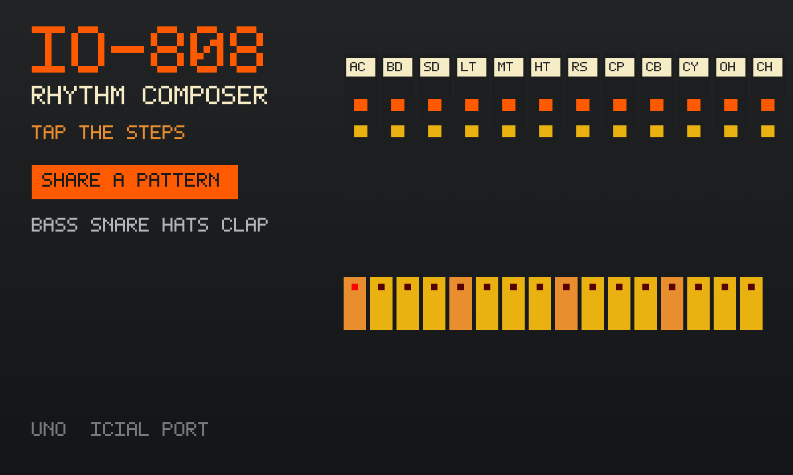

# iO-808

An unofficial local port of
**[io-808](https://github.com/vincentriemer/io-808)** by Vincent Riemer
(MIT). A silver 808 on the table: sixteen steps, twelve voices, orange
knobs. Playing alone, the beat stays on this device. Press **Share a
pattern**, then **Invite**, and a friend gets the same one.

The original is React + Redux + webpack. That stack is not shipped. Drum
graphs, envelopes and the 808 step model are transcribed into classic
scripts (see `vendor/UPSTREAM.txt`).



```
index.html      808 face: instrument strip, transport, 16 steps
style.css       cream labels, orange knobs, yellow pads
synth.js        analog-modelled kit (no samples)
app.js          sequencer, private patterns
mp.js           share a pattern (host applies kits onto the room row)
icon.mjs        procedural 808 icon + 1200×720 cover
build.mjs       packs the GIF into site/apps/io-808/io-808.gif
vendor/         MIT notice + the upstream pin
```

## capabilities

| capability | why |
|---|---|
| `db` | Solo patterns (private) and the room’s shared beat (read-write). Needs nothing newer than the App Store itself, so `minBuild` is **947**. |
| `multiplayer` | The room. Invite is OS chrome — this app never draws its own share sheet. |

No `network`, no `wasm`. Audio is synthesised here.

## The room

**Share a pattern.** Each player writes kit changes on **their own row**.
The elected host (lowest present id) applies a legal kit onto the `kit`
row. Guests never write `kit`. The beat you were working on stays in
`patterns` and is restored when you leave the room.

## Building

```bash
node apps/io-808/build.mjs    # -> site/apps/io-808/io-808.gif
```

Do not run `scripts/build-app-catalog.mjs` from this change — `index.json`
is owned elsewhere.

## Licence

io-808 is MIT, Vincent Riemer, 2016. The notice is packed **inside the GIF**
as `COPYING-io-808.txt` as well as living at `vendor/COPYING-io-808.txt`.
