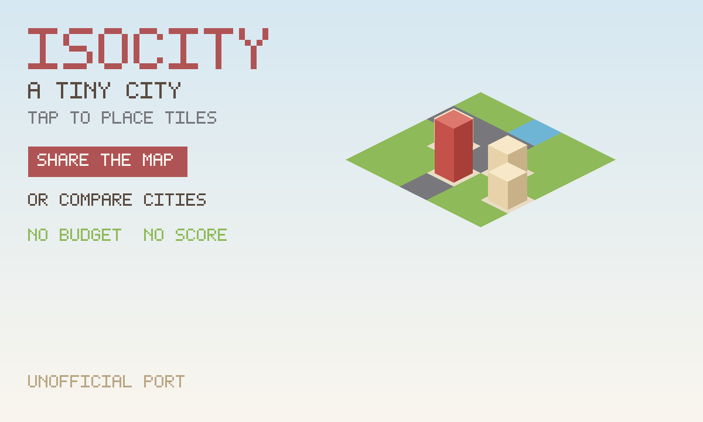

# IsoCity

A tiny isometric city. Tap a tile, put it down. No budget, no score.
**Sixteen tiles on a side** (the original is 7×7; an old save nests in the
middle). Drag to pan, pinch to zoom. Share the map from one invite. The
city lives in the file.

An unofficial port of **[IsoCity](https://github.com/victorqribeiro/isocity)**
by victorqribeiro (MIT). The pictures are Kenney's isometric landscape/city
tiles (CC0). Playing alone is that game, on a bigger map, with the city
saved in the file. Press **Share the map**, then **Invite**, and everyone
paints on the same city — the city you already built, not a blank. On a
phone, drag to pan, pinch to zoom, tap to place (the original was never
designed for a thumb). Press **Compare cities** and each of you keeps your
own, and you can peek.



```
index.html      original two-canvas stage + the share/compare strip
style.css       phone-safe chrome: full-size city in a scrollport
app.js          private save, New city, compact tools, onBack
pan.js          drag pans the map; tap places a tile
mp.js           share-the-map (host applies strokes) and compare-cities
icon.mjs        Kenney-tile growing icon + a built-city cover
vendor.mjs      rebuilds vendor/ from the pinned isocity commit
build.mjs       packs the GIF into site/apps/isocity/isocity.gif
vendor/         GENERATED. Original script (patched) + Kenney sheet.
```

## capabilities

| capability | why |
|---|---|
| `db` | Solo city (private) and the room’s shared map / compared cities (read-write). Needs nothing newer than the App Store itself, so `minBuild` is **947**. |
| `multiplayer` | The room. Invite is OS chrome — this app never draws its own share sheet. |

No `network`, no `wasm`. The original is plain JS and one PNG.

## The room

**Share the map.** Each player writes tile strokes on **their own row**. The
elected host (lowest present id) applies legal placements onto the `city` row.
Guests never write `city`. A stroke that is off the 16×16 grid or names a tile
that does not exist is dropped. A 7×7 city arriving from an older save is
nested in the middle before it is applied.

**Compare cities.** Each player publishes their own city on their own row.
Tap a name to look; you only ever edit yours.

## Building

```bash
node apps/isocity/vendor.mjs      # only when moving the isocity pin (needs net)
node apps/isocity/build.mjs       # -> site/apps/isocity/isocity.gif
```

Do not bump `GIFOS_VERSION`. The catalog refresh (`build-app-catalog.mjs`)
is a separate, signed step.

## Licence

IsoCity is MIT, Victor Ribeiro, 2019. The Kenney tile sheet is CC0. Both
notices are packed **inside the GIF** as `COPYING-isocity.txt` and
`COPYING-kenney.txt`.
