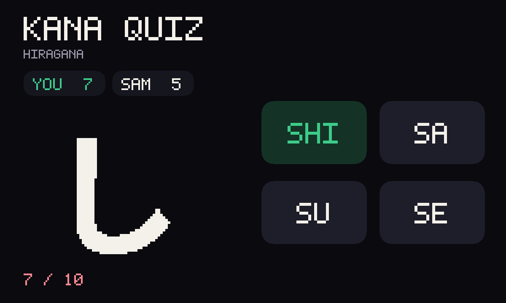

# Kana Quiz

An unofficial port of **[Kana Quiz](https://github.com/anzzstuff/kanaquiz)**
by anzzstuff (MIT, archived). Hiragana and katakana drill: pick rows, a kana,
four sounds. Misses come back in Review. Versus a friend: the same shuffled
deck — first to ten, or more when the cards run out.



Upstream is a React PWA with a service worker and Bootstrap. GifOS's runtime
drops `type="module"` and the sandbox has nowhere to fetch a CDN from, so this
tree is classic scripts and the original kana tables packed inside the GIF.
Nothing is fetched. Progress lives in the file.

```
index.html          picker / drill / race / how-to
style.css           dark #0a0a0f, huge answer buttons
app.js              rules + gifos.db persistence + race
icon.mjs            あ → ア flip icon + 1200×720 cover
build.mjs           packs site/apps/kana-quiz/kana-quiz.gif
vendor/kana.js      original tables, transcribed to a classic script
vendor/COPYING-kanaquiz.txt
```

## Drill

- Hiragana, katakana, or both.
- Rows: あ-row, か-row, … dakuten, yōon, katakana extras.
- Kana → romaji, or reverse (romaji → kana).
- Four huge choices. Immediate right/wrong, running score.
- Missed keys wait in Review.

## Versus

Invite is **OS chrome** — the bar above the app. This game does not draw its
own invite button.

When a second person opens the link, both play the **same** shuffled deck
(host writes the `match` row: seed + deck). Each person writes **only their
own** `players` row (score, index, done). First to ten right wins, or the
higher score when the deck ends.

## capabilities

| capability | why |
|---|---|
| `db` | Solo drill in progress, private, inside the icon. |
| `multiplayer` | Shared match + per-player score rows. Needs nothing newer than the App Store, so `minBuild` is **947**. |

No `network`. The tables are in the GIF. No `wasm`, no `pointer`.

## Building

```bash
node apps/kana-quiz/build.mjs
```

Writes `site/apps/kana-quiz/kana-quiz.gif`. Do not run
`scripts/build-app-catalog.mjs` from this change — `index.json` is owned
elsewhere.

## Licence

anzzstuff's MIT notice (Copyright (c) 2016 Antti Pilto) is packed **inside
the GIF** as `COPYING-kanaquiz.txt` (`vendor/COPYING-kanaquiz.txt`).
