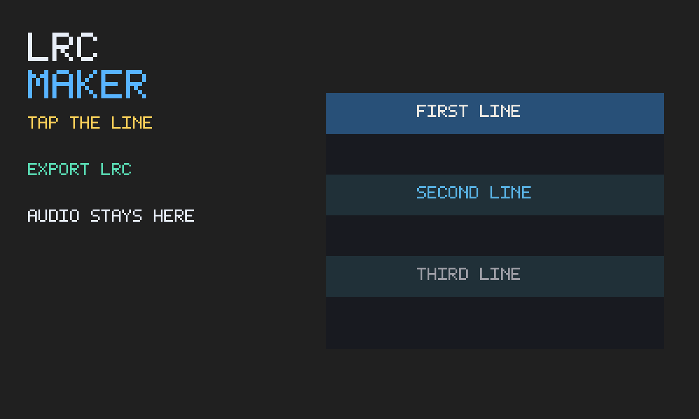

# LRC Maker

An unofficial local port of
**[lrc-maker](https://github.com/magic-akari/lrc-maker)** (MIT) by
magic-akari. Load a local song, tap timings, export LRC. Audio stays
on this device. The React app is not packed; `@lrc-maker/lrc-parser`
is vendored as classic UMD.



## capabilities

`db` + `multiplayer`. `minBuild` **947**. No network, no microphone.
Invite shares lyrics + stamps, not the audio file.

```bash
node apps/lrc-maker/build.mjs
```

Do not run `scripts/build-app-catalog.mjs` from this change.
