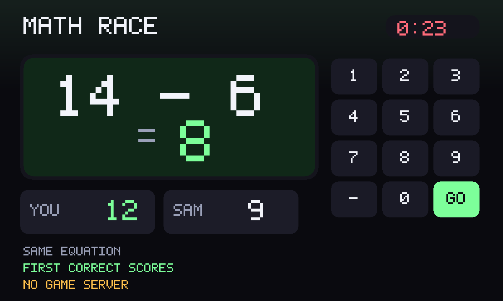

# Math Race

An unofficial port of **[math-race](https://github.com/iloire/math-race)** by
iloire (MIT, archived). Race to solve simple equations against a clock.
Versus a friend: the same equation lands on both devices; first correct
scores.



Upstream is Node + knockout.js + socket.io. The Node process was the starter
pistol, and the public demo (`letsnode.com:8090`) is dead. GifOS's runtime
drops `type="module"` and the sandbox has nowhere to fetch a game server
from, so this tree is classic scripts. The host of a shared round (lowest
live id) is the clock. Invite is OS chrome.

```
index.html      setup / practice / play a friend
style.css       dark #0a0a0f, phone-first pad
race.js         equation generator + scoring (easy is the original 0–20 ±)
app.js          clock, pad, gifos.db, host-authority versus
icon.mjs        procedural icon (equation ticks, score jumps) + 1200×720 cover
build.mjs       packs site/apps/math-race/math-race.gif
vendor/         MIT notice + UPSTREAM pin
```

## Rules

- An equation. Type the answer. Next one as soon as you score.
- Easy: two integers 0–20, `+` or `−` (the original `Operation()`).
- Medium: `×` of 2–12. Hard: mixed.
- A wrong answer flashes and **stays on the same equation**. It does not freeze you.
- Default round is 60 seconds (30 / 90 also). Host is the clock in versus.

## Versus

Invite is **OS chrome** — the bar above the app. This game does not draw its
own invite button.

When a second person opens the link, the host starts a round. Both get the
**same** equation at the same time. First correct scores; live list; the
round ends on the clock. Each person writes **only their own** `players`
row (an answer intent). The host is the only writer of the `match` row.

## capabilities

| capability | why |
|---|---|
| `db` | Best scores, private, inside the icon. Shared match + per-player rows. |
| `multiplayer` | The room. Needs nothing newer than the App Store, so `minBuild` is **947**. |

No `network`. No `wasm`. The generator is plain JavaScript.

## Building

```bash
node apps/math-race/build.mjs
```

Writes `site/apps/math-race/math-race.gif`. Do not run
`scripts/build-app-catalog.mjs` from this change — `index.json` is owned
elsewhere.

## Licence

iloire's MIT notice is packed **inside the GIF** as
`COPYING-math-race.txt` (`vendor/COPYING-math-race.txt`).
