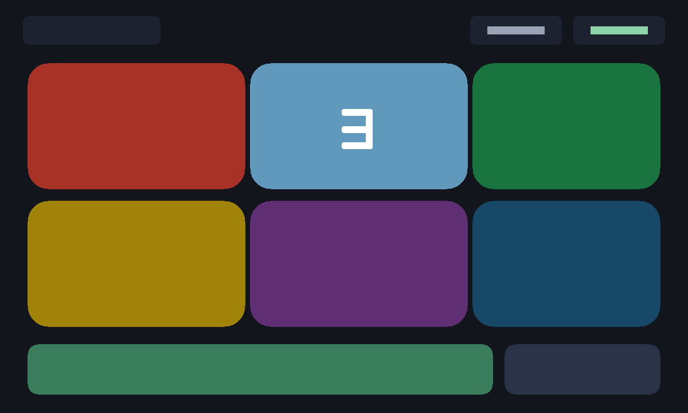

# Memory

An unofficial port of **[Mnimi](https://github.com/sepandhaghighi/mnimi)** by
Sepand Haghighi (MIT). A Simon-style sequence game. Best score in the file.
Invite is a two-device race on the same sequence.



Upstream is SweetAlert + particles + Font Awesome + Bensound. None of that
fits the sandbox. This tree is classic scripts with the original rules
(4 pads, extra pads at 7 and 14, the speed curve), local Web Audio tones,
and a pad that answers a finger.

```
index.html      pads, score, start, mute
style.css       dark pads, 4/6/8 layouts
app.js          rules + gifos.db + race
icon.mjs        four pads lighting + 1200×720 cover
build.mjs       packs site/apps/memory/memory.gif
vendor/         original script.js (pin), MIT notice
```

## Building

```bash
node apps/memory/build.mjs
```

Do not run `scripts/build-app-catalog.mjs` from this change.
