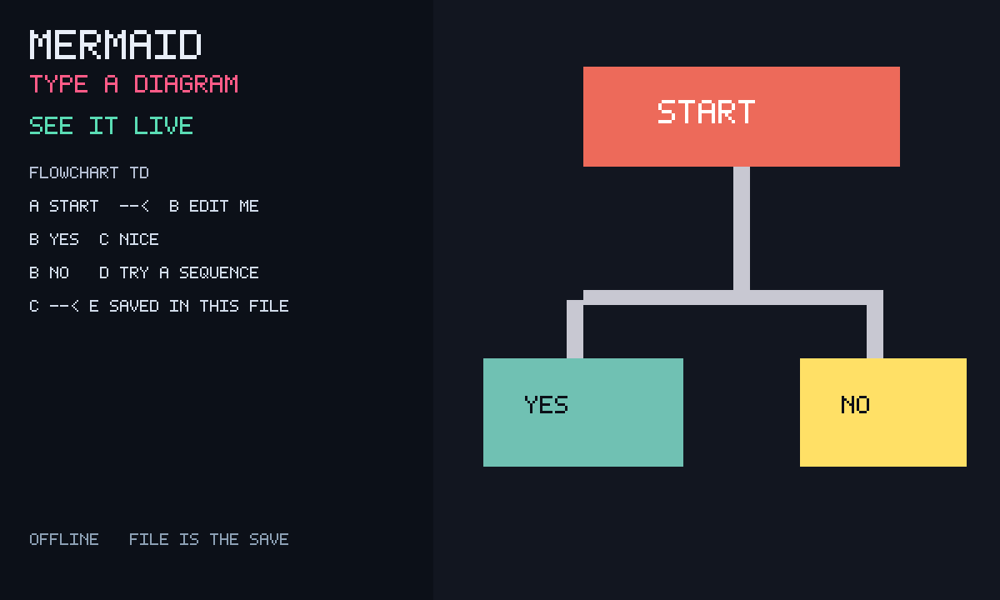

# Mermaid

An unofficial wrap of **[mermaid](https://github.com/mermaid-js/mermaid)**
(MIT) by mermaid-js: vendored IIFE + textarea + live SVG preview. Not
the SvelteKit live editor. Close it, come back — the diagram is still there. On a phone,
Recipe / Picture tabs keep the keyboard off the chart. A bad line keeps
the last good picture.



## capabilities

`db` + `multiplayer`. `minBuild` **947**. No network.

```bash
node apps/mermaid/build.mjs
```

Do not run `scripts/build-app-catalog.mjs` from this change.

Pinned mermaid **10.9.8** UMD (`dist/mermaid.min.js`).
