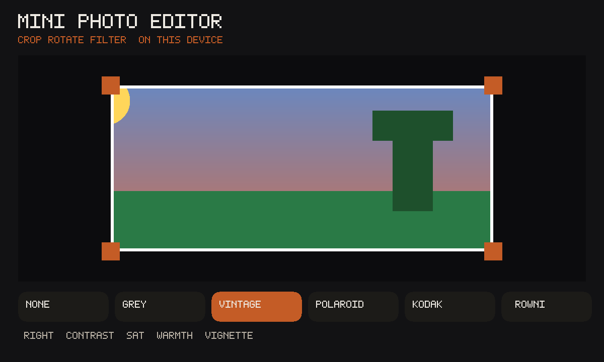

# Mini Photo Editor

An unofficial local port of
**[mini-photo-editor](https://github.com/xdadda/mini-photo-editor)**
(MIT) by xdadda. Crop, rotate, filter a photo on this device. Take a
still or open a file; the picture and the recipe live in the file.
The upstream UI is mini-js + mini-gl; this wrap keeps the crop / rotate /
filter loop as classic JS. Distinct from jspaint (draw) and squoosh
(compress).



## capabilities

`db` + `multiplayer` + `camera`. `minBuild` **947**. No network. Take
photo is a brokered still. Invite shares the recipe (sliders + look),
not the photo.

```bash
node apps/mini-photo-editor/build.mjs
```

Do not run `scripts/build-app-catalog.mjs` from this change.

## Licence

mini-photo-editor is MIT, xdadda, 2025. Notice rides **inside the GIF**.
