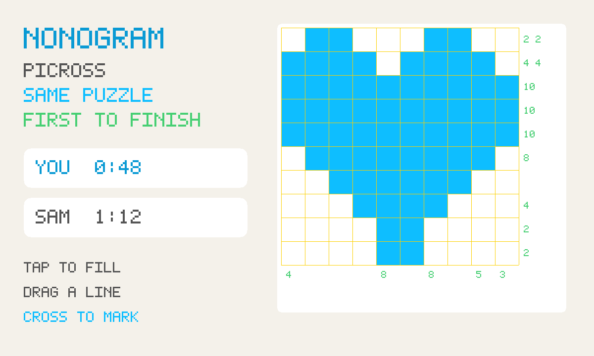

# Nonogram

An unofficial port of **[Nonogram](https://github.com/HandsomeOne/Nonogram)**
by HandsomeOne (MIT). Picross — paint squares from the numbers along the
edge until a picture appears — with a race: the same puzzle, first to
finish wins.



```
index.html      shell: canvas, fill/cross, race strip
style.css       blue filled cells, yellow mesh (upstream's look)
nonogram.js     classic IIFE port of Game + canvas (packed from vendor/)
puzzles.js      picture bank + seeded generator
mp.js           race transport over gifos.db (own row only)
app.js          touch, save, race wiring
icon.mjs        procedural grid icon + 1200×720 screenshot
build.mjs       packs the GIF into site/apps/nonogram/nonogram.gif
vendor/         pinned MIT notice + classic-script Game
```

## What changed from upstream

- **Classic scripts.** Upstream is TypeScript modules (and a worker for
  the solver). GifOS inlines `<script src>` and drops `type=module`, so
  this tree is ordinary IIFE JavaScript: the playable `Game` only.
  Nothing is fetched.
- **Touch.** Upstream only listened for mouse. A finger can paint, drag
  a line, and pick Fill or Cross from the buttons under the board.
- **Save.** Upstream had none. The game in progress goes into a private
  `save` collection, on this device, inside the app.
- **Race.** Solo is the original (your own puzzle, your own timer). Send
  **Invite** from the GifOS menu and both players get the same puzzle.
  Live times and fill progress ride on each player's own row. Nobody
  writes anybody else's.

Invite is OS chrome. This app never draws an invite button.

## capabilities

| capability | why |
|---|---|
| `db` | Solo save (private). Player rows and the race deal (read-write). |
| `multiplayer` | The room. Needs nothing newer than the App Store, so `minBuild` is **947**. |

No `network`. The puzzles are generated inside the GIF.

## Building

```bash
node apps/nonogram/build.mjs
```

Writes `site/apps/nonogram/nonogram.gif`. Do not run
`scripts/build-app-catalog.mjs` from this change — `index.json` is owned
elsewhere.

## Licence

MIT, Zhou Qi. The notice is packed **inside the GIF** as
`COPYING-nonogram.txt` as well as living at
`vendor/COPYING-nonogram.txt`. No upstream PR: this is an unofficial
port.
