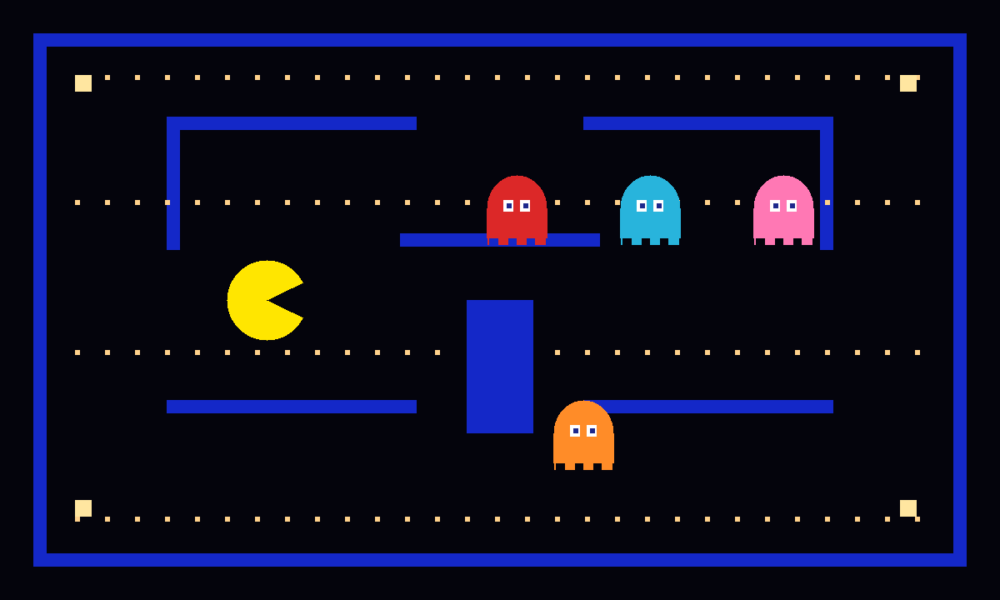

# Pellets

An unofficial port of **[mumuy/pacman](https://github.com/mumuy/pacman)** by Haole
Zheng (MIT). Twelve mazes, real-time ghost pathfinding, power pellets. A pad
for a thumb. Invite puts scores on a shared cabinet.



Upstream is a static canvas page with a CDN font and a site chrome that
anti-frames. GifOS inlines classic scripts and the sandbox has nowhere to
fetch a font from, so this tree is the engine + mazes, monospace text, a
d-pad that is visible on a phone, swipe-to-turn, and `gifos.db` for the
high score and furthest maze.

```
index.html      canvas, pad, roster
style.css       dark cabinet, phone pad
boot.js         scale, d-pad, save, cabinet scores
icon.mjs        chomping yellow + 1200×720 cover
build.mjs       packs site/apps/pacman/pacman.gif
vendor/         pinned engine + mazes, MIT notice
```

## capabilities

| capability | why |
|---|---|
| `db` | High score, private, inside the icon. |
| `multiplayer` | Shared cabinet roster. `minBuild` **947**. |

No `network`. The mazes ride in the GIF.

## Building

```bash
node apps/pacman/build.mjs
```

Do not run `scripts/build-app-catalog.mjs` from this change.

## Licence

Haole Zheng's MIT notice is packed **inside the GIF** as `COPYING-pacman.txt`.
Pac-Man is a trademark of Bandai Namco — this is not affiliated.
