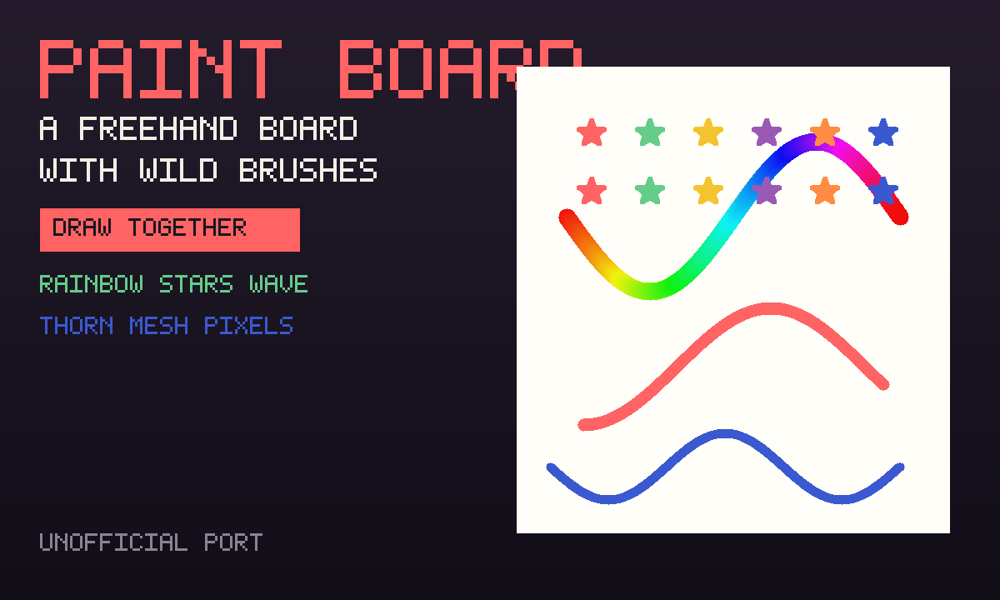

# Paint Board

A freehand board with wild brushes. Playing alone, the picture is saved on
this device. Press **Draw together**, then **Invite**, and everyone paints
on the same board.

An unofficial port of **[paint-board](https://github.com/LHRUN/paint-board)**
by LHRUN (MIT). This is classic canvas, not the React + Fabric.js editor.



```
index.html      chrome, brush strip, paper canvas
style.css       dark chrome around a cream page
board.js        brushes (basic, rainbow, stars, crayon, pixels, stripe,
                web, mesh, dots, wave, thorn) + eraser
mp.js           shared board (host applies strokes)
app.js          private save, New picture, onBack
icon.mjs        procedural rainbow-card icon + 1200×720 cover
build.mjs       packs the GIF into site/apps/paint-board/paint-board.gif
COPYING-paint-board.txt   upstream MIT notice (also packed inside the GIF)
UPSTREAM.txt    pin + what this copy keeps / drops
```

## capabilities

| capability | why |
|---|---|
| `db` | Solo picture (private) and the room’s shared board (read-write). Needs nothing newer than the App Store itself, so `minBuild` is **947**. |
| `multiplayer` | The room. Invite is OS chrome — this app never draws its own share sheet. |

No `network`, no `wasm`. Nothing is fetched.

## The room

**Draw together.** Each player writes paint strokes on **their own row**. The
elected host (lowest present id) applies legal strokes onto the `board` row.
Guests never write `board`. A stroke that names an unknown brush, a colour
that is not a colour, or points off the 0–999 page is dropped.

## Building

```bash
node apps/paint-board/build.mjs       # -> site/apps/paint-board/paint-board.gif
```

Do not bump `GIFOS_VERSION`. The catalog refresh (`build-app-catalog.mjs`)
is a separate, signed step.

## Licence

paint-board is MIT, LH_R / LHRUN, 2022. The notice is packed **inside the
GIF** as `COPYING-paint-board.txt`.
