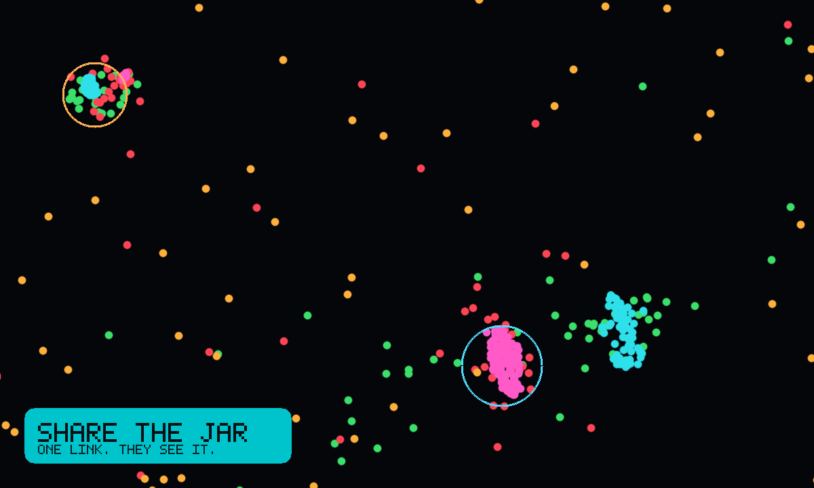

# Particle Life

An unofficial local port of
**[Particle Life](https://github.com/hunar4321/particle-life)** by hunar4321
(MIT). Coloured specks attract and repel; they clump into little
life-like shapes. Tap to stir. Playing alone is that toy. Press
**Share the jar**, then **Invite**, and a friend watches the same mix —
each of you pokes on your own. The mix lives in the file.



```
index.html                 shell: the jar, mix/reset, friend-mode strip
style.css                  dark jar, dashed border, friend chrome
app.js                     touch stir, last mix in gifos.db, the knobs
mp.js                      shared mix, own-row pokes, live roster
icon.mjs                   clustering icon + cover from a real poured jar
vendor.mjs                 rebuilds vendor/COPYING from the pinned commit
build.mjs                  packs the GIF into site/apps/particle-life/particle-life.gif
vendor/particle-life.js    extracted attraction loop. See UPSTREAM.txt.
vendor/COPYING-*.txt       hunar4321's MIT notice, packed inside the GIF
```

## capabilities

| capability | why |
|---|---|
| `db` | Last mix (private) and the room’s pokes (read-write). Needs nothing newer than the App Store itself, so `minBuild` is **947**. |
| `multiplayer` | The room. Invite is OS chrome — this app never draws its own share sheet. |

No `network`, no `wasm`. The original is plain JS plus a CDN GUI; the GUI stays behind.

## How the jar is shared

1. Press **Share the jar**. Press **Invite** (the GifOS menu) to send the link.
   Solo still works if nobody comes — you can stir while you wait.
2. A friend who opened the invite sits down in the jar on their own. Everyone
   **starts from the same mix**. The seed lives on each player’s own row;
   everyone adopts the seed of the lowest-id player on the current round.
   Same likes, same shies, same opening spots.
3. Each player publishes a **poke** (where they touched, push or pull) on
   **their own row**. Nobody writes anybody else’s row. A poke arriving on
   someone else’s row is applied locally as a stir.
4. **New mix** starts the next round with a fresh seed. **← Solo** puts you
   back on the original toy.

Honest limits: this is a shared jar, not a lockstep film. Each browser
runs the specks itself, so after a while two jars of the same mix will
drift — a poke still lands in the same *place*, on whatever the specks
are doing there. A player who goes silent for a few seconds drops off
the list. The host’s browser holds the room; if they leave and nobody
chose **keep the room alive** on Invite, the jar empties.

## Touch

Upstream is a mouse click (shift-click pulls). `app.js` maps a finger on
the jar onto the same pulse, and a Push / Pull button stands in for
shift on a phone. Dragging keeps stirring. Right-click pulls on a
computer. `r` pours a new mix; `o` resets, same as upstream.

## Building

```bash
node apps/particle-life/vendor.mjs   # only when moving the pin (needs net)
node apps/particle-life/build.mjs    # -> site/apps/particle-life/particle-life.gif
```

Do not run `scripts/build-app-catalog.mjs` from this change — `index.json`
is owned elsewhere.

## Licence

Particle Life is MIT, Hunar Ahmad, 2022. The notice is packed
**inside the GIF** as `COPYING-particle-life.txt` as well as living at
`vendor/COPYING-particle-life.txt`.
