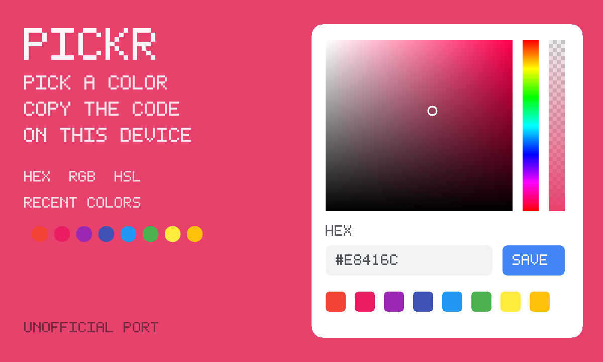

# Pickr

A color picker you can actually use. The screen fills with the color. Copy
hex, RGB, HSL or CMYK. Recent colors stay on this device.

An unofficial port of **[Pickr](https://github.com/simonwep/pickr)** by
simonwep (MIT).



```
index.html      wash, copy lines, recent row, inline picker
style.css       contrast-aware wash around the classic theme
app.js          private recents, copy, onBack-free persist
icon.mjs        procedural hue-ring icon + 1200×720 cover
vendor.mjs      rebuilds vendor/ from the pinned @simonwep/pickr release
build.mjs       packs the GIF into site/apps/pickr/pickr.gif
vendor/         GENERATED. Classic UMD + classic theme CSS + MIT notice.
```

## capabilities

| capability | why |
|---|---|
| `db` | Recent colors and the last color, in a **private** collection. Needs nothing newer than the App Store itself, so `minBuild` is **947**. |

No `network`, no `wasm`, no `multiplayer`. The original is one classic script.

## Building

```bash
node apps/pickr/vendor.mjs      # only when moving the pickr pin (needs net)
node apps/pickr/build.mjs       # -> site/apps/pickr/pickr.gif
```

Do not bump `GIFOS_VERSION`. The catalog refresh (`build-app-catalog.mjs`)
is a separate, signed step.

## Licence

Pickr is MIT, Simon Reinisch (simonwep), 2018. The notice is packed
**inside the GIF** as `COPYING-pickr.txt`.
