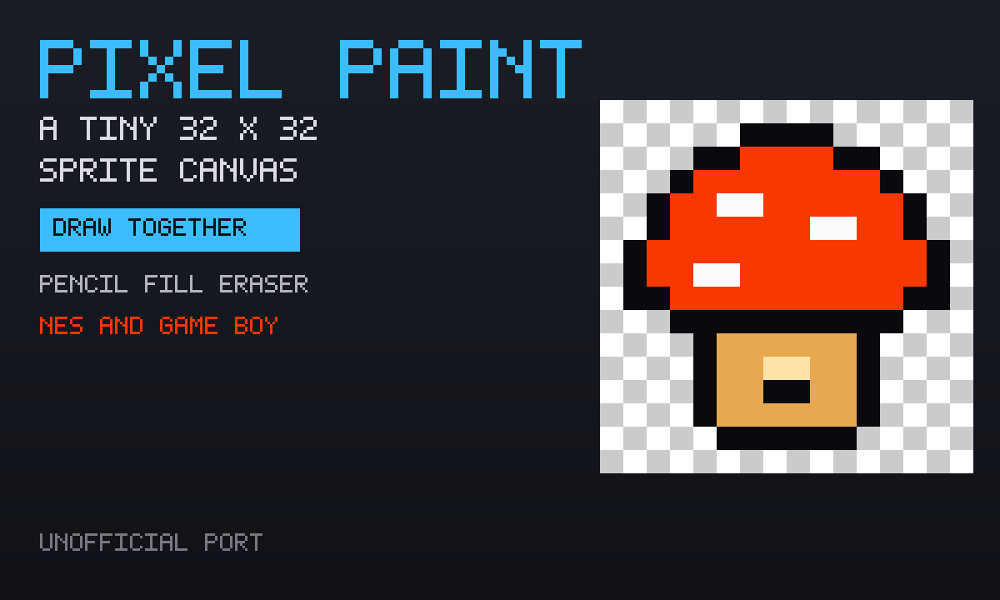

# Pixel Paint

A tiny 32×32 pixel canvas. Pencil, fill, eraser, a colour picker, NES and
Game Boy palettes. Playing alone, the sprite is saved on this device. Press
**Draw together**, then **Invite**, and everyone paints on the same board.

An unofficial port of **[Pixel Paint](https://github.com/Kully/pixel-paint)**
by Kully (MIT). This is the small vanilla-JS canvas, not Piskel.



```
index.html      original toolbar + 32×32 grid, plus the draw-together strip
style.css       phone-safe chrome around upstream's dark page
app.js          private save, New picture, onBack
mp.js           shared board (host applies strokes)
icon.mjs        procedural NES-canvas icon + 1200×720 cover
vendor.mjs      rebuilds vendor/ from the pinned pixel-paint commit
build.mjs       packs the GIF into site/apps/pixel-paint/pixel-paint.gif
vendor/         GENERATED. Original scripts (patched) + inlined toolbar icons.
```

## capabilities

| capability | why |
|---|---|
| `db` | Solo sprite (private) and the room’s shared board (read-write). Needs nothing newer than the App Store itself, so `minBuild` is **947**. |
| `multiplayer` | The room. Invite is OS chrome — this app never draws its own share sheet. |

No `network`, no `wasm`. The original is plain JS and a handful of 16×16 PNGs
(inlined as data URLs so the CSS still paints once the stylesheet is inlined).

## The room

**Draw together.** Each player writes paint strokes on **their own row**. The
elected host (lowest present id) applies legal cell paints onto the `board`
row. Guests never write `board`. A stroke that is off the 32×32 or names a
colour that is not a colour is dropped.

## Building

```bash
node apps/pixel-paint/vendor.mjs      # only when moving the pixel-paint pin (needs net)
node apps/pixel-paint/build.mjs       # -> site/apps/pixel-paint/pixel-paint.gif
```

Do not bump `GIFOS_VERSION`. The catalog refresh (`build-app-catalog.mjs`)
is a separate, signed step.

## Licence

Pixel Paint is MIT, Adam Kulidjian (Kully), 2020. The notice is packed
**inside the GIF** as `COPYING-pixel-paint.txt`.
