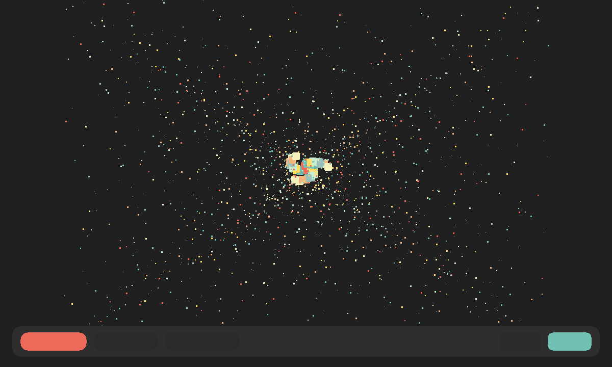

# Polygon Shredder

An unofficial local port of
**[The Polygon Shredder](https://github.com/spite/polygon-shredder)**
(MIT) by spite. Cubes shred into confetti. Playing alone is that toy.
Press **Play together**, then **Invite**, and a friend sees the same knobs.



```
index.html                 shell: the stage, knobs, friend chrome
style.css                  dark grey, coral share
app.js                     last knobs in gifos.db
mp.js                      shared knobs, own-row publish
icon.mjs                   procedural confetti icon + 1200×720 cover
vendor.mjs                 rebuilds COPYING from the pinned commit
build.mjs                  packs the GIF
vendor/three.min.js        three.js as shipped by upstream
vendor/shaders.js          GLSL from index.html
vendor/Simulation.js       FBO particle sim
vendor/shredder.js         main loop, no social, procedural spotlight
```

## capabilities

`db` + `multiplayer`. `minBuild` **947**. No network. The original
`spotlight.jpg` is generated as a radial, not fetched. A weak GPU
gets a smaller cloud (Lite / Medium / Full) instead of a black screen.

## Building

```bash
node apps/polygon-shredder/build.mjs
```

Do not run `scripts/build-app-catalog.mjs` from this change.

## Licence

The Polygon Shredder is MIT, Jaume Sanchez, 2016. three.js is MIT.
Notices ride **inside the GIF**.
