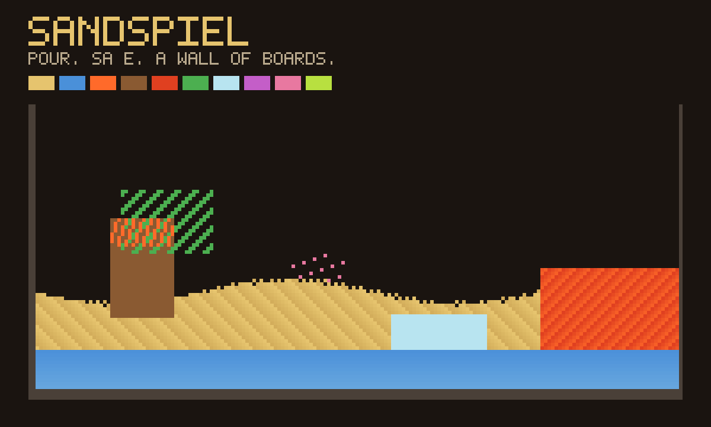

# Sandspiel

An unofficial local port of
**[Sandspiel](https://github.com/MaxBittker/sandspiel)** by Max Bittker
(MIT). Pour sand, water, fire, plants. Playing alone is that toy.
The world lives in the file. Press **Play together**, then
**Invite**, and a meeting room is a wall of saved boards — lean cards,
full grids loaded on tap. No account, no public gallery.



```
index.html                 shell: the world, palette, brush, saves, wall
style.css                  warm dark sand, gold accent, friend chrome
species.js                 classic rewrite of crate/src/species.rs + tick
vendor/kernel.c            same tick, compiled to wasm32 at pack time
wasm.js                    instantiate from bytes in the GIF; JS fallback
app.js                     paint, pause, undo, private last + named boards
wall.js                    room cards + presence; boards loaded with get()
icon.mjs                   hourglass of sand/water/fire/plant + 1200×720 cover
build.mjs                  packs the GIF into site/apps/sandspiel/sandspiel.gif
vendor/COPYING-sandspiel.txt  Max Bittker MIT notice, packed inside the GIF
vendor/UPSTREAM.txt        pin + what stayed behind
```

## What stayed behind

Upstream is React + webpack. The live loop fetches a hashed
`.module.wasm` from the Rust crate, plus a WebGL fluid / wind field.
Saves and the public gallery went through Firebase. Sentry, ads, and a
service worker sat around that. **None of that ships here.** This copy
is a classic-script rewrite of `species.rs` + the `Universe` tick, with
the same tick compiled to wasm32 from `vendor/kernel.c` and packed
inside the GIF. Wind skipped. Grid is 180×120 (the crate’s 300×300 is
too heavy in JS; the wasm kernel keeps the saved-board size).

If the engine does not start, the JS tick still pours and a sentence
says so — never a black canvas.

## capabilities

| capability | why |
|---|---|
| `db` | Last board + named boards (`save`, private). Lean wall cards + presence (`room`, read-write, subscribed). Full packed grids (`boards`, read-write, **not** subscribed — loaded with `get`). |
| `multiplayer` | The wall is a meeting room. Invite is OS chrome — this app never draws its own share sheet. |
| `wasm` | The pouring engine is bytes in the GIF (`WebAssembly.instantiate` from `SAND_WASM_B64`). Off, or a failed boot, falls back to `species.js`. |

No `network`, no `fullscreen`, no `camera`. `minBuild` is **947**.

## Building

```bash
node apps/sandspiel/build.mjs
```

Needs `clang --target=wasm32` (no `wasm-ld`: the object file is the
module). Do not run `scripts/build-app-catalog.mjs` from this change —
`index.json` is owned elsewhere.

## Licence

Sandspiel is MIT, Max Bittker, 2018. The notice is packed
**inside the GIF** as `COPYING-sandspiel.txt` as well as living at
`vendor/COPYING-sandspiel.txt`.
