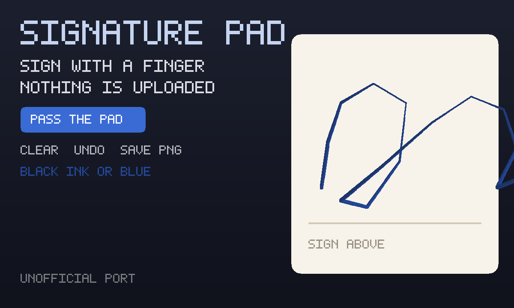

# Signature Pad

A pad you sign with a finger or a mouse. Playing alone, the last signature is
saved on this device, and you can save a PNG. Press **Pass the pad**, then
**Invite**, and everyone who opens the link gets their own line on the same
sheet.

An unofficial port of **[signature_pad](https://github.com/szimek/signature_pad)**
by szimek (MIT).



```
index.html      cream paper pad + the pass-the-pad strip
style.css       dark chrome around the paper
app.js          private save, PNG, ink, undo, onBack
mp.js           the sheet: each person signs their own row
icon.mjs        procedural signed-paper icon + 1200×720 cover
vendor.mjs      rebuilds vendor/ from the pinned signature_pad release
build.mjs       packs the GIF into site/apps/signature-pad/signature-pad.gif
vendor/         GENERATED. Classic UMD + MIT notice.
```

## capabilities

| capability | why |
|---|---|
| `db` | Solo signature (private) and the room’s sheet of lines (read-write). Needs nothing newer than the App Store itself, so `minBuild` is **947**. |
| `multiplayer` | The room. Invite is OS chrome — this app never draws its own share sheet. |

No `network`, no `wasm`. The original is one classic script.

## The sheet

**Pass the pad.** Each player writes their strokes on **their own row**.
Nobody writes anybody else’s row. There is no shared board: the sheet is just
those rows. Save PNG in a meeting writes the whole sheet.

## Building

```bash
node apps/signature-pad/vendor.mjs      # only when moving the signature_pad pin (needs net)
node apps/signature-pad/build.mjs       # -> site/apps/signature-pad/signature-pad.gif
```

Do not bump `GIFOS_VERSION`. The catalog refresh (`build-app-catalog.mjs`)
is a separate, signed step.

## Licence

signature_pad is MIT, Szymon Nowak (szimek), 2018. The notice is packed
**inside the GIF** as `COPYING-signature_pad.txt`.
