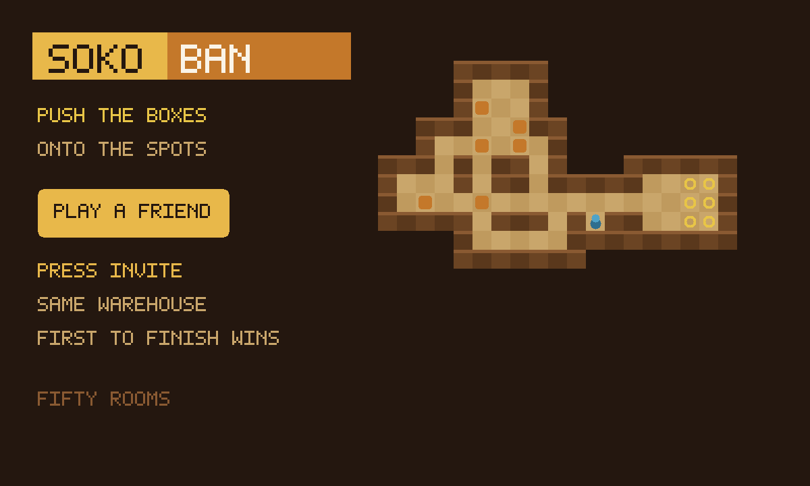

# Sokoban

Push the boxes onto the spots. Playing alone is that puzzle. Press **Play a
friend**, then **Invite**, and it becomes a race on the same warehouse —
first to park every box wins.

An unofficial port of **[sokoban](https://github.com/klevze/sokoban)** by
klevze (MIT). The original is Vite modules, a tileset and Firebase. This copy
rebuilds the same fifty warehouses as classic scripts so they run in the
sandbox, including on a phone.



```
index.html      shell: warehouse, friend strip, d-pad
style.css       dark wood, gold crate, stacked for a phone
game.js         push / undo / restart — classic IIFE
mp.js           the race: same warehouse, own rows, first to park
touch.js        swipe the floor + a pad on first touch
app.js          canvas, keys, private save
icon.mjs        procedural crate icon + 1200×720 cover
build.mjs       packs the GIF into site/apps/sokoban/sokoban.gif
vendor.mjs      rebuilds vendor/ from the pinned klevze/sokoban commit
vendor/         fifty compacted warehouses + MIT notice (packed inside the GIF)
```

## What changed from upstream

- **Classic scripts.** Upstream is Vite `import` modules. GifOS inlines
  `<script src>` and drops `type=module`, so this tree is ordinary IIFE
  JavaScript. The warehouses travel inside the GIF. Nothing is fetched.
- **No Firebase, no editor, no i18n, no service worker, no music.** A finger
  can push. Undo and restart are on the bar.
- **Save.** Upstream wrote `localStorage` (and a cloud account). A GifOS app
  cannot. The room in progress goes into a private `save` collection, on this
  device, inside the app.
- **Race.** Solo is the original (your own warehouse, your own moves). Send
  **Invite** from the GifOS menu and both players get the same room. Live
  move counts ride on each player's own row. Nobody writes anybody else's.

Invite is OS chrome. This app never draws an invite button.

## capabilities

| capability | why |
|---|---|
| `db` | Solo save (private) and the room’s live scores (read-write). Needs nothing newer than the App Store itself, so `minBuild` is **947**. |
| `multiplayer` | The room. Invite is OS chrome — this app never draws its own share sheet. |

No `network`, no `wasm`. Classic JS.

## How the race works

1. Press **Play a friend**. Press **Invite** (the GifOS menu) to send the link.
   Solo still works if nobody comes — you can push while you wait.
2. Everyone who is in the room **works the same warehouse**. The level lives on
   each player’s own row; everyone adopts the level of the lowest-id player on
   the current round.
3. Each player publishes **solved + move count** on **their own row**. The
   floor itself never leaves this device.
4. **First to park every box wins.** Fewer moves is the tie-break if two
   people finish in the same moment.
5. **Next warehouse** starts the next round on the next room. **← Solo** puts
   you back on the original game, with the save you had.

## Building

```bash
node apps/sokoban/vendor.mjs   # only when moving the pin (needs net)
node apps/sokoban/build.mjs    # -> site/apps/sokoban/sokoban.gif
```

Writes `site/apps/sokoban/sokoban.gif`. Do not run
`scripts/build-app-catalog.mjs` from this change — `index.json` is owned
elsewhere.

## Licence

MIT, Gregor (klevze), 2025. The notice is packed **inside the GIF** as
`COPYING-sokoban.txt` as well as living at `vendor/COPYING-sokoban.txt`.
No upstream PR: this is an unofficial port.
