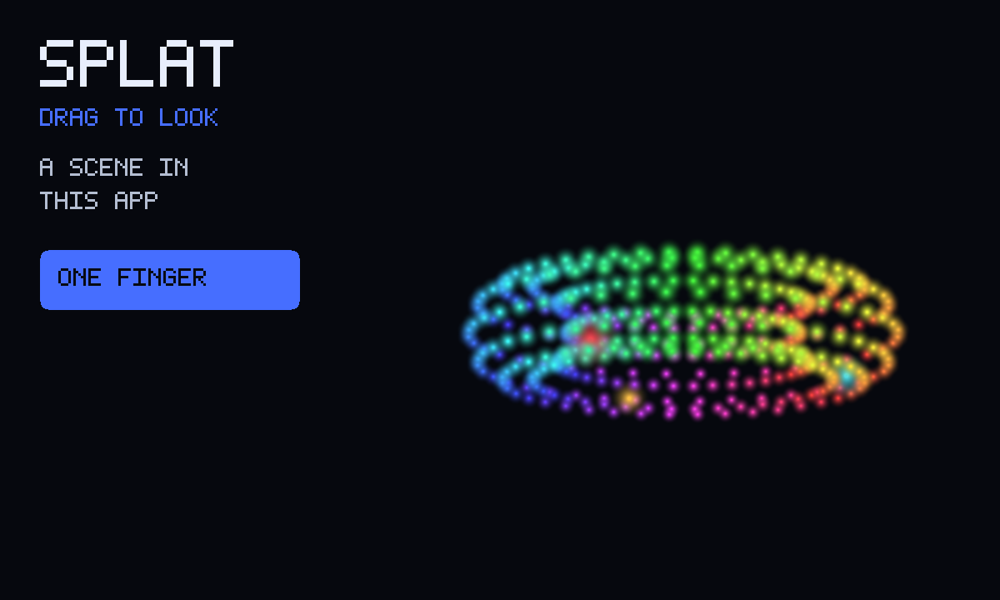

# Splat

A tiny 3D scene you spin with a finger. The scene lives in this app.

An unofficial port of **[splat](https://github.com/antimatter15/splat)** by
antimatter15 (MIT). The original loads a scene from the internet; this copy
carries a little one of its own, so it works with no network at all.



```
index.html            shell: canvas, spinner, a few words of help
style.css             full-window dark stage, touch-action none
scene.js              builds the packed scene (ring, balls, ground)
icon.mjs              procedural ring-of-blobs icon + 1200×720 cover
vendor.mjs            rebuilds vendor/COPYING from the pinned commit
build.mjs             packs the GIF into site/apps/splat/splat.gif
vendor/main.js        antimatter15's viewer, fetch removed, sort on this thread
vendor/COPYING-*.txt  Kevin Kwok's MIT notice, packed inside the GIF
```

## Why this can run as a GifOS app

Upstream is one classic script and a WebGL 1-style pipeline that happens to
use WebGL 2 (no extra libraries). GifOS inlines `<script src>` as classic
scripts, which this already is.

The original fetches `train.splat` from Hugging Face. A sandboxed app has no
network path, so `scene.js` builds a few thousand specks at boot — a ring of
colour, three balls, a patch of ground — and hands the bytes to the viewer as
`window.SPLAT_SCENE`. Nothing is fetched.

Upstream sorted specks in a blob Worker. The sandbox only allows those when
`capabilities.wasm` is set, and a scene this small sorts in a millisecond on
the same thread, so this copy does that and stays off the wasm hatch.

## capabilities

None. WebGL already works in the sandbox. Needs nothing newer than the App
Store itself, so `minBuild` is **947**.

No `network`, no `wasm`, no `db`. Touch orbit is upstream's (one finger
orbits; two fingers pinch / pan). `touch-action: none` lives on the canvas
and the page.

## Building

```bash
node apps/splat/vendor.mjs   # only when moving the pin (needs net)
node apps/splat/build.mjs    # -> site/apps/splat/splat.gif
```

Do not run `scripts/build-app-catalog.mjs` from this change — `index.json`
is owned elsewhere.

## Licence

splat is MIT, Kevin Kwok, 2023. The notice is packed **inside the GIF** as
`COPYING-splat.txt` as well as living at `vendor/COPYING-splat.txt`.
