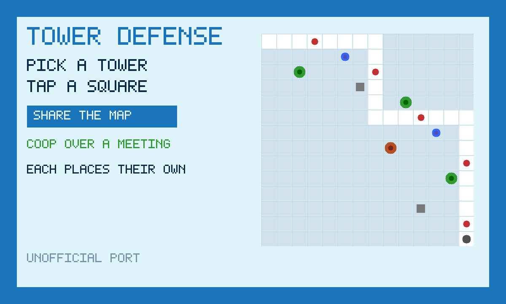

# Tower Defense

Pick a tower, tap a square, don't let them through.

An unofficial port of **[HTML5 Tower Defense](https://github.com/oldj/html5-tower-defense)**
by oldj (MIT). Playing alone is that game. Press **Share the map**, then
**Invite**, and everyone places towers on the same map. Each person writes
their own placements.



```
index.html      original canvas stage + the share strip + a thumb picker
style.css       phone-safe chrome around upstream's blue page
boot.js         start, best wave, onBack
mp.js           share-the-map (host applies placements)
touch.js        HTML picker → the same preBuild / upgrade / sell / pause
icon.mjs        procedural icon + 1200×720 cover
vendor.mjs      rebuilds vendor/ from the pinned html5-tower-defense commit
build.mjs       packs the GIF into site/apps/tower-defense/tower-defense.gif
vendor/         GENERATED. Original classic scripts, patched.
```

## capabilities

| capability | why |
|---|---|
| `db` | Best wave in `prefs` (private). Shared map / placements in `room` (read-write). Needs nothing newer than the App Store itself, so `minBuild` is **947**. |
| `multiplayer` | The room. Invite is OS chrome — this app never draws its own share sheet. |

No `network`, no `wasm`. Upstream draws every sprite; there are no pictures to fetch.

## The room

**Share the map.** Each player writes placements (place / upgrade / sell) on
**their own row**. The elected host (lowest present id) applies legal ones
onto the `map` row. Guests never write `map`. A placement off the 16×16 grid,
naming a tower that does not exist, or sitting on a blocked path is dropped.
You only upgrade or sell a tower you placed.

## Building

```bash
node apps/tower-defense/vendor.mjs   # only when moving the pin (needs net)
node apps/tower-defense/build.mjs    # -> site/apps/tower-defense/tower-defense.gif
```

Do not bump `GIFOS_VERSION`. The catalog refresh (`build-app-catalog.mjs`)
is a separate, signed step.

## Licence

HTML5 Tower Defense is MIT, oldj, 2011–2017. The notice is packed **inside
the GIF** as `COPYING.txt` as well as living here, because a copy of this app
that someone was handed is a distribution of that work.
