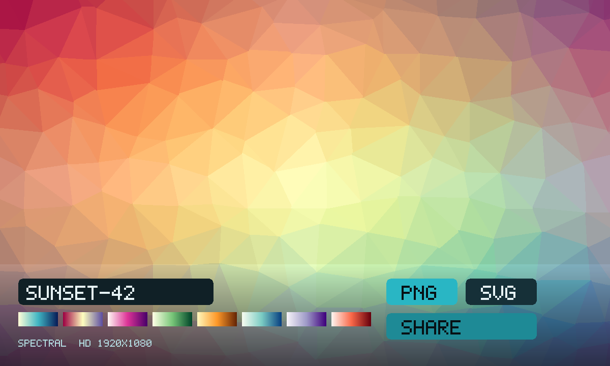

# Trianglify

An unofficial local port of
**[Trianglify](https://github.com/qrohlf/trianglify)** (GPL-3.0) by
Quinn Rohlf. Low-poly triangle wallpapers. Pick a palette, type a seed,
download a PNG or SVG. Playing alone is that generator. Press **Share
the wallpaper**, then **Invite**, and a friend sees the same seed.



```
index.html                 shell: stage, palettes, sliders, export
style.css                  full-bleed wallpaper, frosted dock, friend bar
app.js                     paint / seed / last wallpaper in gifos.db
mp.js                      shared seed+palette, own-row publish
icon.mjs                   procedural triangle-card icon + 1200×720 cover
vendor.mjs                 rebuilds vendor/ from the pinned npm tarball
build.mjs                  packs the GIF into site/apps/trianglify-studio/
vendor/trianglify.js       GENERATED. trianglify@4.1.1 classic UMD IIFE
vendor/COPYING-*.txt       Quinn Rohlf's GPLv3 notice, packed inside the GIF
COPYING.txt                the same GPLv3, at the app root
```

## capabilities

| capability | why |
|---|---|
| `db` | Last palette+seed (private) and the room’s recipe (read-write). Needs nothing newer than the App Store itself, so `minBuild` is **947**. |
| `multiplayer` | The room. Invite is OS chrome — this app never draws its own share sheet. |

No `network`, no `wasm`. The original GUI is trianglify.io (paid
high-res). The library is the UMD bundle; node-canvas is not shipped.

A `launch` block lets a link open onto a seed and/or a named palette.

## How the wallpaper is shared

1. Press **Share the wallpaper**. Press **Invite** (the GifOS menu) to
   send the link. Solo still works if nobody comes.
2. Everyone who is in the room **starts from the same seed**. The recipe
   lives on each player’s own row; everyone adopts the recipe of the
   lowest-id player on the current round.
3. Rolling a seed, picking a palette, or dragging a slider publishes a
   new round. Nobody writes anybody else’s row.
4. **← Solo** puts you back on the original generator.

The host’s browser holds the room; if they leave and nobody chose
**keep the room alive** on Invite, the shared wallpaper empties.

## Building

```bash
node apps/trianglify-studio/vendor.mjs   # only when moving the pin (needs net)
node apps/trianglify-studio/build.mjs    # -> site/apps/trianglify-studio/trianglify-studio.gif
```

Do not run `scripts/build-app-catalog.mjs` from this change — `index.json`
is owned elsewhere.

## Licence

Trianglify is GPLv3, Quinn Rohlf. The notice is packed **inside the GIF**
as `COPYING.txt` and `COPYING-trianglify.txt`. This studio is a modified
work under the same licence (2026-08-30). You own the pictures you
export; the generator’s source is copyleft.
