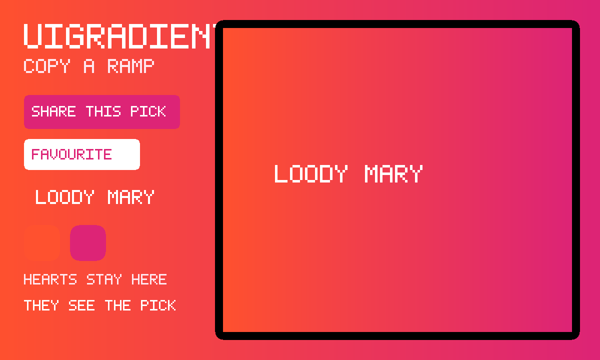

# uiGradients

An unofficial local port of
**[uiGradients](https://github.com/ghosh/uiGradients)** (MIT). A gallery
of colour ramps. Flip through, copy a colour or the whole recipe. Hearts
stay on this device. Playing alone is that gallery. Press **Share this
pick**, then **Invite**, and a friend sees the same ramp.



```
index.html                 shell: the ramp, swatches, browse grid
style.css                  full-bleed ramp, frosted chrome, friend bar
app.js                     browse / copy / last pick + hearts in gifos.db
mp.js                      shared pick, own-row publish
icon.mjs                   procedural ramp-card icon + 1200×720 cover
vendor.mjs                 rebuilds vendor/ from the pinned gradients.json
build.mjs                  packs the GIF into site/apps/ui-gradients/ui-gradients.gif
vendor/gradients.json      GENERATED. ghosh/uiGradients community list.
vendor/gradients.js        GENERATED. same list as a classic IIFE.
vendor/COPYING-*.txt       Indrashish Ghosh's MIT notice, packed inside the GIF
```

## capabilities

| capability | why |
|---|---|
| `db` | Hearts and the last pick (private) and the room’s pick (read-write). Needs nothing newer than the App Store itself, so `minBuild` is **947**. |
| `multiplayer` | The room. Invite is OS chrome — this app never draws its own share sheet. |

No `network`, no `wasm`. The original Vue site cannot ride in (GifOS
drops `type=module`); the colour list is vendored as a classic script.

## How the pick is shared

1. Press **Share this pick**. Press **Invite** (the GifOS menu) to send
   the link. Solo still works if nobody comes.
2. Everyone who is in the room **starts from the same ramp**. The name
   and direction live on each player’s own row; everyone adopts the pick
   of the lowest-id player on the current round.
3. Picking another ramp, turning it, or opening one from the list
   publishes a new round. Nobody writes anybody else’s row.
4. **← Solo** puts you back on the original gallery. Hearts never leave
   this device.

The host’s browser holds the room; if they leave and nobody chose
**keep the room alive** on Invite, the shared pick empties.

## Building

```bash
node apps/ui-gradients/vendor.mjs   # only when moving the pin (needs net)
node apps/ui-gradients/build.mjs    # -> site/apps/ui-gradients/ui-gradients.gif
```

Do not run `scripts/build-app-catalog.mjs` from this change — `index.json`
is owned elsewhere.

## Licence

uiGradients is MIT, Indrashish Ghosh, 2017. The notice is packed
**inside the GIF** as `COPYING-uigradients.txt` as well as living at
`vendor/COPYING-uigradients.txt`.
