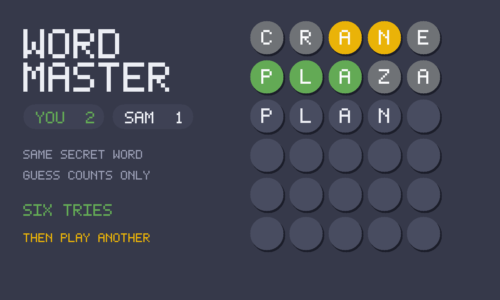

# Word Master

Unlimited word-guessing: six tries, green / yellow / gray, as many rounds as
you like. Versus a friend, the same secret word — guess counts only.

An unofficial port of **[Word Master](https://github.com/octokatherine/word-master)**
by octokatherine (MIT). Upstream is a Create-React-App module graph; GifOS's
runtime drops `type="module"`, so this tree is classic scripts and static files.
The word lists travel inside the GIF. Nothing is fetched.



```
index.html      shell: board, keyboard, how-to, settings
style.css       circular neumorphic tiles (upstream's look, no webfonts)
app.js          rules + gifos.db persistence + versus
words.js        GENERATED from vendor lists at pack time
icon.mjs        procedural letter-tile icon + 1200×720 cover
build.mjs       packs site/apps/word-master/word-master.gif
vendor/         pinned lists + MIT notice (packed inside the GIF)
```

## Rules (same as upstream)

- Six guesses at a five-letter word, picked from the secret list.
- A guess must be a valid word (Normal). Easy accepts any five letters. Hard
  also demands you use every green and yellow hint you already have.
- Green: right letter, right place. Yellow: right letter, wrong place.
  Gray: not in the word.
- Finish one, play another. There is no daily lock.

## Versus

Invite is **OS chrome** — the bar above the app. This game does not draw its
own invite button.

When a second person opens the link, both play the **same** secret word.
Each person writes **only their own** `players` row, and only a guess
*count* (and whether they have solved), never the word and never the
letters. First to solve wins; if both get there, fewer guesses wins; a
tie on guesses goes to whoever finished first.

## capabilities

| capability | why |
|---|---|
| `db` | Solo streak and the in-progress game, private, inside the icon. |
| `multiplayer` | Shared match + per-player rows. Needs nothing newer than the App Store, so `minBuild` is **947**. |

No `network`. The lists are in the GIF.

## Building

```bash
node apps/word-master/build.mjs
```

Writes `site/apps/word-master/word-master.gif`. Do not run
`scripts/build-app-catalog.mjs` from this change — `index.json` is owned
elsewhere.

## Licence

Katherine Peterson's MIT notice is packed **inside the GIF** as
`COPYING-word-master.txt` (`vendor/COPYING-word-master.txt`).
