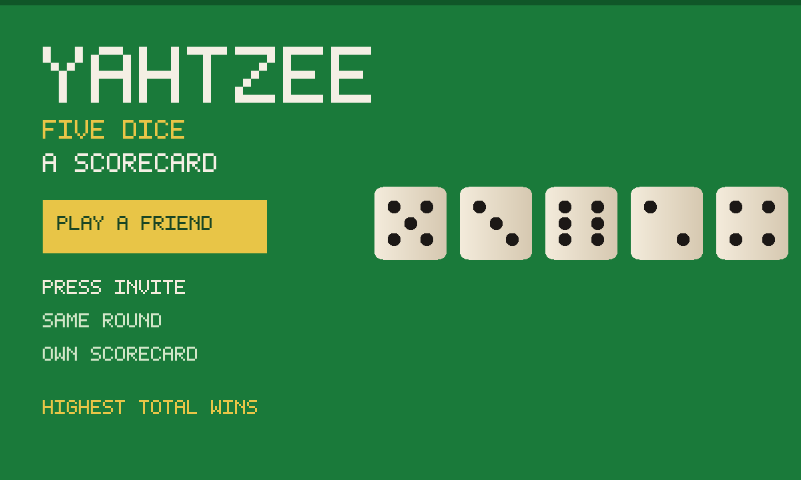

# Yahtzee

An unofficial local port of [Alhissar/Yahtzee](https://github.com/Alhissar/Yahtzee)
(MIT). Five dice, a scorecard, thirteen turns. Playing alone is that game.
Press **Play a friend**, then **Invite**, and it becomes a table: one round,
each of you filling your own card.



## What it is

Upstream is a felt table of playing-card dice (ones through sixes, French
names on the card: Brelan, Carré, suite, Full, Yahtzee). The JS, CSS and
art are the original, converted to classic scripts because GifOS drops
`type=module`. Two things changed, both because they have to:

- **Save.** Upstream wrote nothing. The best score and the game in progress
  go into a private `save` collection, on this device, inside the app.
- **A table.** Upstream is strictly one player. This adds a shared round.
  It is not a shared scorecard.

```
index.html      original table markup + the friend-mode strip
style.css       friend-mode chrome (the felt is upstream)
storage.js      best + in-progress over gifos.db('save'), private
mp.js           the table: shared round, own rows, live totals
app.js          boot, art wait, Invite-aware reset
icon.mjs        procedural dice icon + 1200×720 cover
vendor.mjs      rebuilds vendor/ from the pinned Yahtzee commit
build.mjs       packs the GIF into site/apps/yahtzee/yahtzee.gif
vendor/         GENERATED. Classic scripts + inlined felt art.
```

## capabilities

| capability | why |
|---|---|
| `db` | Solo save (private) and the room’s live totals (read-write). Needs nothing newer than the App Store itself, so `minBuild` is **947**. |
| `multiplayer` | The room. Invite is OS chrome — this app never draws its own share sheet. |

No `network`, no `wasm`. The original is plain JS.

## How the table works

1. Press **Play a friend**. Press **Invite** (the GifOS menu) to send the link.
   Solo still works if nobody comes — you can fill your card while you wait.
2. Everyone who is in the room **plays the same round**. The round number
   lives on each player’s own row; everyone adopts the highest round of the
   lowest-id player. Dice are yours. The scorecard is yours.
3. Each player publishes **total + filled lines** on **their own row**.
   Nobody writes anybody else’s row. The list of live scores is just those
   rows.
4. When every remaining card is full, **highest total** wins. A tie is a tie.
5. **Play again** starts the next round. **← Solo** puts you back on the
   original game, with the save you had before the table.

Honest limits: this is friends, not a ladder. There is no referee and no
anti-cheat — a client that lied about its total would be believed. A player
who goes silent for a few seconds drops off the list. The host’s browser
holds the room; if they leave and nobody chose **keep the room alive** on
Invite, the table ends. A joiner who arrives mid-round starts a fresh card
on that round — they are playing, not spectating.

## Building

```bash
node apps/yahtzee/vendor.mjs      # only when moving the Yahtzee pin (needs net)
node apps/yahtzee/build.mjs       # -> site/apps/yahtzee/yahtzee.gif
```

Do not bump `GIFOS_VERSION`. The catalog refresh (`build-app-catalog.mjs`)
is a separate, signed step.

## Licence

Yahtzee is MIT, Alhissar, 2019. The notice is packed **inside the GIF** as
`COPYING-yahtzee.txt` as well as living at `vendor/COPYING-yahtzee.txt`.
